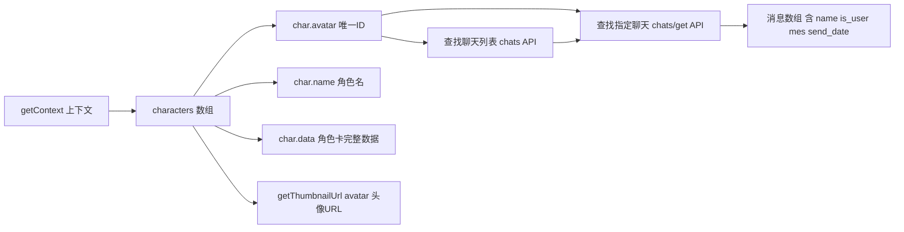

# 角色卡数据与头像读取（可复用文档）

> 目标：供「酒馆小说阅读器」新插件复用——如何识别"有这个角色"、如何读取角色卡数据、如何拿到角色头像 URL。
>
> 核心结论一句话：**`char.avatar` 是角色的唯一 ID（角色卡文件名，如 `character_name.png`）**，所有查找/识别/头像都围绕它展开。

---

## 1. 数据流总览



- **角色列表**：`ctx.characters`（全部已加载角色卡数组）
- **唯一标识**：`char.avatar`（文件名，如 `Rin_Tohsaka.png`）
- **显示名**：`char.name`
- **完整数据**：`char.data`（description / personality / first_mes / scenario / character_book 等所有字段）
- **头像 URL**：`ctx.getThumbnailUrl("avatar", char.avatar)`

---

## 2. 读取角色卡数据（识别角色）

### 2.1 获取全部角色数组

来源：[`features/folders/tree.js`](features/folders/tree.js:80) L80-82

```js
export function getCharactersCore(deps) {
  return deps.getContext().characters || [];
}
```

index.js 薄包装层（[`index.js`](index.js:1481) L1481-1483）：

```js
function getCharacters() {
  return getCharactersCore({ getContext });
}
```

返回的每个元素结构（SillyTavern 角色卡标准结构）：

```js
{
  avatar: "Rin_Tohsaka.png",   // 唯一 ID = 角色卡文件名
  name: "远坂凛",               // 显示名
  data: {
    name: "远坂凛",
    description: "...",          // 角色描述
    personality: "...",          // 性格
    scenario: "...",             // 场景
    first_mes: "...",            // 开场白
    mes_example: "...",
    creator: "...",              // 创作者
    character_version: "...",    // 版本
    character_book: { ... },     // 内嵌世界书
    extensions: { world: "...", ... },
    alternate_greetings: [...],  // 备用开场白
  },
  // 以下为运行时附加字段
  chat: "...",          // 当前聊天文件名
  create_date: 123,
  favorite: false,
  tags: [...],
  // ...
}
```

### 2.2 按 avatar 查找某个角色（"识别到有这个角色"）

项目内大量使用的标准写法（如 [`features/folders/delete.js`](features/folders/delete.js:73)、[`features/chatlogs/pinning.js`](features/chatlogs/pinning.js:262)）：

```js
const characters = getCharacters();                       // 全部角色
const char = characters.find((c) => c.avatar === avatar); // 按 ID 查找
if (!char) {
  // 角色不存在，跳过/提示
  return;
}
// 拿到角色
const charName = char.name;      // 显示名
const charData = char.data;      // 完整角色卡
const charCreator = char.data?.creator || "";           // 创作者
const charVersion = char.data?.character_version || ""; // 版本
```

### 2.3 按索引查找 + 当前角色

```js
const charIdx = characters.findIndex((c) => c.avatar === avatar); // 索引（部分原生 API 需要）
const char = characters[charIdx];
```

获取当前正在对话的角色：

```js
// 项目内 getCurrentCharAvatar 的实现模式
const currentAvatar = getContext().characterId !== undefined
  ? (getContext().characters[getContext().characterId]?.avatar ?? null)
  : null;
```

> 注：`ctx.characterId` 是当前角色的索引，`ctx.characters[ctx.characterId]` 即当前角色卡对象。

---

## 3. 读取角色头像 URL

### 3.1 标准头像缩略图 URL（最常用）

来源：[`ui/list/list-view.js`](ui/list/list-view.js:497) L497、[`features/chatlogs/pinning.js`](features/chatlogs/pinning.js:281) L281

```js
const thumbUrl = getThumbnailUrl("avatar", char.avatar);
// 渲染
``
```

- `getThumbnailUrl(type, file)` 是 `ctx.getThumbnailUrl(type, file)` 的薄包装（[`index.js`](index.js:1484) L1484-1486）
- type 固定传 `"avatar"`，file 传 `char.avatar`
- 返回值形如 `/img/avatars/Rin_Tohsaka.png`（自动带缓存时间戳参数）
- **`onerror="this.src='/img/ai4.png'"` 是兜底**：头像文件缺失时回退默认图，必须保留

### 3.2 persona（User）头像

来源：[`features/personas/view.js`](features/personas/view.js:445) L445、[`ui/views/personas-view.js`](ui/views/personas-view.js:832) L832

```js
const thumbUrl = getThumbnailUrl("persona", p.avatarId);
```

> 小说阅读器里 User 消息的头像就是 `getThumbnailUrl("persona", 当前personaId)`，或直接默认 `/img/ai4.png`。

### 3.3 聊天记录行里的角色头像（置顶聊天卡片示例）

来源：[`features/chatlogs/pinning.js`](features/chatlogs/pinning.js:281) L281-310

```js
const char = characters.find((c) => c.avatar === pin.avatar);
if (!char) continue;
const thumbUrl = getThumbnailUrl("avatar", char.avatar);
const eName = escapeHtml(char.name);

chatItem.innerHTML = `
  <div class="avatar" title="[Character] ${eName}&#10;File: ${escapeHtml(pin.avatar)}">
    
  </div>
  <div class="recentChatInfo">
    <div class="chatNameContainer">
      <strong class="characterName">${eName}</strong>
      <span>${escapeHtml(pin.chatFileName)}</span>
    </div>
  </div>`;
```

---

## 4. 聊天记录中的消息角色（小说说话人识别）

### 4.1 获取某角色的聊天列表

来源：[`features/chatlogs/cache.js`](features/chatlogs/cache.js:12) L12-62

```js
// 方式一：原生模块函数（优先）
const scriptModule = await import("../../../../../script.js");
const getPastCharacterChats = scriptModule.getPastCharacterChats;
const chats = await getPastCharacterChats(charIdx); // 按角色索引

// 方式二：HTTP 回退
const ctx = getContext();
const response = await fetch("/api/characters/chats", {
  method: "POST",
  body: JSON.stringify({ avatar_url: avatar }),   // ← avatar 即角色 ID
  headers: ctx.getRequestHeaders(),
});
const data = await response.json();
const chats = Object.values(data)  // { [fileName]: {file_name, ...} }
  .sort((a, b) => a["file_name"].localeCompare(b["file_name"]))
  .reverse();
```

### 4.2 获取指定聊天文件的内容（消息数组）

来源：[`features/chatlogs/pinning.js`](features/chatlogs/pinning.js:266) L266-280

```js
const resp = await fetch("/api/chats/get", {
  method: "POST",
  headers: getContext().getRequestHeaders(),
  body: JSON.stringify({
    avatar_url: pin.avatar,   // 角色 ID
    file_name: "聊天文件名.jsonl",
  }),
});
const chatData = await resp.json();   // 消息数组
if (!Array.isArray(chatData) || chatData.length === 0) continue;
```

### 4.3 消息对象结构（小说渲染的说话人字段）

SillyTavern 聊天消息（jsonl 每行一条）标准字段：

```js
{
  name: "远坂凛",        // 说话人显示名（角色名 / User 名 / 群员名）
  is_user: false,        // true = 用户消息
  is_system: false,      // true = 系统消息（不渲染）
  is_name: true,         // 是否显示名字
  send_date: 1712345678, // 发送时间戳（秒）
  mes: "消息正文……",     // 消息内容
  extra: { ... },        // 可选
  // 群聊时还有
  is_group: true,
  character_id: 2,       // 群成员在群里的角色索引
  // 或
  group_avatar: "...",   // 群成员头像
}
```

小说渲染的关键判断逻辑（本项目 `pinning.js` 只取了 `mes`/`send_date`，小说阅读器需要补全说话人判断）：

```js
function resolveSpeaker(msg, char) {
  if (msg.is_system) return null;           // 系统消息不显示说话人
  if (msg.is_user) return { name: "User", avatar: null, isUser: true };
  const speakerName = msg.name || char?.name || "角色";
  // 单角色聊天：非 User 消息都归该角色卡
  return { name: speakerName, avatar: msg.character_id !== undefined ? null : char?.avatar, isUser: false };
}
```

> 经验：**单角色聊天里，`is_user: false` 且 `is_system: false` 的消息说话人就是该角色卡**（`char.name`），头像用 `getThumbnailUrl("avatar", char.avatar)`。群聊消息才有 `character_id`/`group_avatar` 需要额外映射。

### 4.4 时间格式化（小说章节时间线）

来源：[`features/chatlogs/pinning.js`](features/chatlogs/pinning.js:287) L287-293

```js
const { timestampToMoment } = getContext();
const m = timestampToMoment(sendDate);   // send_date 秒级时间戳
const dateShort = m.format("l");          // 短日期
const dateLong = m.format("LL LT");       // 长日期+时间
```

---

## 5. 小说阅读器最小实现示例（可直接抄）

```js
// ========== 依赖注入（模仿 CFM Core 工厂模式） ==========
export function createNovelReaderApiCore(deps) {
  const { getContext, getCharacters, getThumbnailUrl } = deps;

  // 1. 全部角色列表（角色选择器用）
  function getAllCharacters() {
    return getCharacters().map((c) => ({
      id: c.avatar,          // 唯一 ID
      name: c.name,          // 显示名
      thumbUrl: getThumbnailUrl("avatar", c.avatar),  // 头像 URL
    }));
  }

  // 2. 按 ID 识别角色（"识别到有这个角色"）
  function getCharacterById(avatar) {
    return getCharacters().find((c) => c.avatar === avatar) || null;
  }

  // 3. 读取某角色的聊天列表
  async function listChats(avatar) {
    const ctx = getContext();
    const resp = await fetch("/api/characters/chats", {
      method: "POST",
      body: JSON.stringify({ avatar_url: avatar }),
      headers: ctx.getRequestHeaders(),
    });
    if (!resp.ok) return [];
    const data = await resp.json();
    if (data?.error === true) return [];
    return Object.values(data).sort((a, b) =>
      a["file_name"].localeCompare(b["file_name"]),
    ).reverse();
  }

  // 4. 读取指定聊天全部消息（小说正文）
  async function readChat(avatar, fileName) {
    const ctx = getContext();
    const resp = await fetch("/api/chats/get", {
      method: "POST",
      body: JSON.stringify({ avatar_url: avatar, file_name: fileName }),
      headers: ctx.getRequestHeaders(),
    });
    const data = await resp.json();
    return Array.isArray(data) ? data : [];
  }

  // 5. 消息 → 小说章节条目（过滤系统消息 + 标注说话人）
  function toNovelEntries(chatData, char) {
    const charThumb = getThumbnailUrl("avatar", char.avatar);
    return chatData
      .filter((m) => !m.is_system)   // 去掉系统消息
      .map((m) => ({
        speaker: m.is_user ? "User" : (m.name || char.name),
        isUser: !!m.is_user,
        avatarUrl: m.is_user ? "/img/ai4.png" : charThumb,
        text: m.mes || "",
        time: m.send_date,
      }));
  }

  return { getAllCharacters, getCharacterById, listChats, readChat, toNovelEntries };
}
```

---

## 6. 常见坑与经验

| #   | 坑                                           | 说明                                                                                                               |
| --- | -------------------------------------------- | ------------------------------------------------------------------------------------------------------------------ |
| 1   | `char.avatar` 是**文件名**不是 ID 数字       | 含 `.png` 后缀，如 `Rin_Tohsaka.png`；查找用全等 `===`                                                             |
| 2   | `ctx.characters` 可能未加载完                | 页面刚启动时为空，需在 `SillyTavern.getContext().eventSource` 的 `charactersLoaded` 事件后再读，或监听 `app_ready` |
| 3   | 头像必须走 `getThumbnailUrl`                 | 直接拼 `/img/avatars/${avatar}` 可行但无缓存参数；且 persona 类型不同，统一走 API 最稳                             |
| 4   | 头像 `onerror` 兜底必加                      | 角色卡文件被删/移动后头像 404，`onerror="this.src='/img/ai4.png'"` 防破图                                          |
| 5   | `/api/chats/get` 返回的 `send_date` 是**秒** | `timestampToMoment` 直接吃，但若自己 `new Date()` 需 `* 1000`                                                      |
| 6   | 消息 `is_system` 要过滤                      | 系统消息（如"对话开始"）不是小说正文                                                                               |
| 7   | 群聊消息说话人需额外映射                     | 单角色聊天靠 `is_user` + `char.name` 足够；群聊才有 `character_id`/`group_avatar`                                  |
| 8   | `getPastCharacterChats` 需要**索引**         | 原生函数吃 `charIdx` 而非 avatar，先 `findIndex`                                                                   |
| 9   | 请求需带 `getRequestHeaders()`               | 所有 `/api/*` POST 都要传，否则 401                                                                                |
| 10  | `escapeHtml` 防 XSS                          | 角色名/消息正文渲染进 HTML 前必须转义                                                                              |

---

## 7. 文件速查

| 文件                                                               | 行号       | 内容                                                     |
| ------------------------------------------------------------------ | ---------- | -------------------------------------------------------- |
| [`features/folders/tree.js`](features/folders/tree.js:80)          | L80-82     | `getCharactersCore`：返回 `ctx.characters` 全部角色      |
| [`index.js`](index.js:1481)                                        | L1481-1486 | `getCharacters` / `getThumbnailUrl` 薄包装               |
| [`features/chatlogs/cache.js`](features/chatlogs/cache.js:12)      | L12-62     | 聊天列表读取（原生函数 + `/api/characters/chats` 回退）  |
| [`features/chatlogs/pinning.js`](features/chatlogs/pinning.js:266) | L266-310   | `/api/chats/get` 读消息 + 角色头像渲染 + 时间格式化      |
| [`ui/list/list-view.js`](ui/list/list-view.js:497)                 | L496-525   | 角色行渲染（头像/名字/创作者/版本）                      |
| [`integrations/sillytavern.js`](integrations/sillytavern.js:29)    | L29-37     | 动态导入 script.js 取 `getPastCharacterChats` 等原生 API |
| [`features/personas/view.js`](features/personas/view.js:445)       | L444-464   | persona 头像 `getThumbnailUrl("persona", id)`            |

---

## 8. 与小说阅读器需求的映射

| 小说阅读器需求                           | 复用来源                                                                                                                                               |
| ---------------------------------------- | ------------------------------------------------------------------------------------------------------------------------------------------------------ |
| 角色选择器（全部角色列表 + 头像 + 名字） | §2.1 + §3.1（`getCharacters` + `getThumbnailUrl`）                                                                                                     |
| 识别某个聊天属于哪个角色                 | §2.2（`characters.find(c => c.avatar === avatar)`）                                                                                                    |
| 非当前角色的聊天列表                     | §4.1（`/api/characters/chats` + `avatar_url`）                                                                                                         |
| 非当前聊天记录的小说正文                 | §4.2（`/api/chats/get`）                                                                                                                               |
| 说话人标注（角色/User/系统）             | §4.3（`is_user` / `is_system` / `name` / `char.name`）                                                                                                 |
| 消息时间线（章节日期）                   | §4.4（`timestampToMoment(send_date)`）                                                                                                                 |
| 头像兜底防破图                           | §3.1（`onerror="this.src='/img/ai4.png'"`）                                                                                                            |
| 打开某条聊天（从小说跳回酒馆）           | `openChatFile`：[`features/chatlogs/import-export.js`](features/chatlogs/import-export.js:204) L204-230（`selectCharacterById` + `openCharacterChat`） |

---

## 9. 补充：跳回酒馆打开聊天（可选增强）

小说阅读器若支持"点击章节跳回酒馆对应聊天"，直接复用：

```js
async function openChatFile(avatar, chatFileName) {
  const characters = getCharacters();
  const charIdx = characters.findIndex((c) => c.avatar === avatar);
  if (charIdx < 0) return;
  const ctx = getContext();
  const fileNameNoExt = chatFileName.replace(/\.jsonl$/i, "");
  if (ctx.selectCharacterById) {
    await ctx.selectCharacterById(charIdx);          // 先选中角色
  }
  if (openCharacterChatFunc) {
    await openCharacterChatFunc(fileNameNoExt);      // 再打开聊天
  } else if (ctx.openCharacterChat) {
    await ctx.openCharacterChat(fileNameNoExt);
  }
  closeMainPopup();
}
```

> `openCharacterChatFunc` 来自动态导入 `script.js`（[`integrations/sillytavern.js`](integrations/sillytavern.js:35) L35）。注意：这是**切换当前酒馆会话**的操作，会改变当前聊天状态，小说阅读器内调用需确认用户意图（加确认弹窗）。

---

*文档结束。核心一句话：`char.avatar` 是角色唯一 ID，`getThumbnailUrl("avatar", char.avatar)` 是头像 URL，`/api/chats/get` 是消息正文，`is_user`/`is_system`/`name` 决定说话人。*                         |
