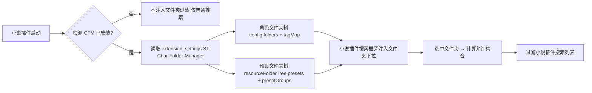

# 双插件「搜索框文件夹过滤」桥接方案（方案A：小说插件单向读取 CFM 数据）

> 目标：仅针对**同时安装了「酒馆小说阅读器」+「AAAA-ST-Folder-Manager-V2（CFM）」**的用户，在小说插件的**角色搜索框**和**预设搜索框**旁添加「文件夹过滤」功能。过滤的是**小说插件自己的搜索结果列表**（不是酒馆原生列表）。
>
> 核心结论一句话：**CFM 的文件夹数据全部存在全局 `extension_settings["ST-Char-Folder-Manager"]` 命名空间里，任何插件都能直接读。小说插件检测到该命名空间存在（CFM 已安装）后，读取文件夹树 + 条目归属映射，在自家搜索框旁注入文件夹下拉，按选中文件夹过滤自己的搜索结果。CFM 完全不用改。**

---

## 1. 方案总览（方案A：零侵入单向读取）



**为什么不用改 CFM**：CFM 的角色文件夹树存于 `extension_settings["ST-Char-Folder-Manager"].folders`，角色归属存于 SillyTavern 全局 `tagMap`（`getContext().tagMap[avatar] = [tagId...]`）；预设文件夹树存于 `.resourceFolderTree.presets`，预设归属存于 `.presetGroups[name] = folderId`。这些都是全局可读的纯数据，小说插件按同一套 key 读取即可。

---

## 2. CFM 数据契约（小说插件需要读取的全部字段）

### 2.1 关键常量

来源：[`core/constants.js`](core/constants.js:4)

```js
export const extensionName = "ST-Char-Folder-Manager";
```

- **CFM 命名空间**：`extension_settings["ST-Char-Folder-Manager"]`
- **CFM 已安装检测**：`extension_settings["ST-Char-Folder-Manager"]` 存在即可（CFM 首次运行 `ensureSettingsDefaults` 会创建它，见 [`settings/defaults.js`](settings/defaults.js:19)）

### 2.2 角色文件夹数据

| 数据            | 位置                       | 结构                                                | 来源                                                       |
| --------------- | -------------------------- | --------------------------------------------------- | ---------------------------------------------------------- |
| 角色文件夹树    | `CFM.folders`              | `{ [tagId]: { parentId, displayName, sortOrder } }` | [`core/storage.js`](core/storage.js:11)                    |
| 角色→文件夹归属 | `getContext().tagMap`      | `{ [avatar]: [tagId...] }`                          | SillyTavern 全局                                           |
| 文件夹 ID 集合  | `Object.keys(CFM.folders)` | `[tagId...]`                                        | [`features/folders/tree.js`](features/folders/tree.js:207) |

**角色归属判定（叶子标签模式）**——来源：[`features/folders/counts.js`](features/folders/counts.js:27)：

```js
// 一个角色归属某文件夹 = tagMap[avatar] 含该 folderId，且不含任何子文件夹 id
function isCharInFolder(avatar, folderId) {
  const childIds = Object.keys(CFM.folders).filter(
    (id) => CFM.folders[id].parentId === folderId,
  );
  const charTags = tagMap[avatar] || [];
  if (!charTags.includes(folderId)) return false;
  for (const childId of childIds) {
    if (charTags.includes(childId)) return false; // 在子文件夹则不算父文件夹
  }
  return true;
}
```

### 2.3 预设文件夹数据

| 数据            | 位置                             | 结构                                                    | 来源                                          |
| --------------- | -------------------------------- | ------------------------------------------------------- | --------------------------------------------- |
| 预设文件夹树    | `CFM.resourceFolderTree.presets` | `{ [folderId]: { parentId, sortOrder, displayName? } }` | [`settings/schema.js`](settings/schema.js:40) |
| 预设→文件夹归属 | `CFM.presetGroups`               | `{ [presetName]: folderId }`                            | [`index.js`](index.js:816)                    |

**预设归属判定**——来源：[`integrations/native-filters.js`](integrations/native-filters.js:694)：

```js
// 一个预设归属某文件夹 = presetGroups[name] === folderId（含递归子文件夹）
function presetInFolder(name, folderId) {
  return CFM.presetGroups?.[name] === folderId;
}
```

### 2.4 文件夹显示名

来源：[`features/folders/tree.js`](features/folders/tree.js:84)：

```js
// 角色文件夹：优先 CFM.folders[id].displayName，回退 id 本身
// 预设文件夹：优先 resourceFolderTree.presets[id].displayName，回退 id 本身
function getFolderDisplayName(type, id) {
  if (type === "chars") {
    return CFM.folders[id]?.displayName || id;
  }
  return CFM.resourceFolderTree?.presets?.[id]?.displayName || id;
}
```

> ⚠️ 注意：CFM 的文件夹 ID 可能就是文件夹名本身（未重命名时 `displayName` 为空）。展示给用户时用 `displayName || id`。

---

## 3. 小说插件侧的完整实现（可直接使用）

### 3.1 CFM 桥接读取模块（novel-cfm-bridge.js）

```js
// ==================== CFM 数据桥接（方案A：单向读取，CFM 零修改） ====================
const CFM_NS = "ST-Char-Folder-Manager";

/**
 * 检测 CFM 是否已安装并初始化过
 */
export function isCfmInstalled(deps = {}) {
  const extSettings =
    deps.getExtensionSettings?.() || deps.extensionSettings || {};
  return !!extSettings[CFM_NS];
}

/**
 * 读取 CFM 角色文件夹树（含 displayName 补全）
 */
export function getCfmCharFolders(deps = {}) {
  const extSettings =
    deps.getExtensionSettings?.() || deps.extensionSettings || {};
  return extSettings[CFM_NS]?.folders || {};
}

/**
 * 读取 CFM 预设文件夹树
 */
export function getCfmPresetFolders(deps = {}) {
  const extSettings =
    deps.getExtensionSettings?.() || deps.extensionSettings || {};
  return extSettings[CFM_NS]?.resourceFolderTree?.presets || {};
}

/**
 * 角色归属：tagMap[avatar] = [tagId...]（SillyTavern 全局，getContext().tagMap）
 */
export function getCharTagMap(deps = {}) {
  return deps.getContext?.().tagMap || {};
}

/**
 * 预设归属：presetGroups[name] = folderId
 */
export function getCfmPresetGroups(deps = {}) {
  const extSettings =
    deps.getExtensionSettings?.() || deps.extensionSettings || {};
  return extSettings[CFM_NS]?.presetGroups || {};
}

/**
 * 取某文件夹的直接子文件夹 ID 列表（排序）
 */
function getChildIds(tree, parentId) {
  return Object.keys(tree)
    .filter((id) => tree[id]?.parentId === parentId)
    .sort((a, b) => {
      const oa = tree[a]?.sortOrder ?? 0;
      const ob = tree[b]?.sortOrder ?? 0;
      if (oa !== ob) return oa - ob;
      return (tree[a]?.displayName || a).localeCompare(
        tree[b]?.displayName || b,
        "zh-CN",
      );
    });
}

/**
 * 递归收集某文件夹下所有条目（含子文件夹）
 * @param {string} type - 'chars' | 'presets'
 * @param {string|null} folderId - 文件夹 id，'__all__' 或 null 表示全部
 * @returns {Set<string>} chars 为 avatar 集合，presets 为预设名集合
 */
export function getCfmItemsInFolder(type, folderId, deps = {}) {
  const items = new Set();
  if (!folderId || folderId === "__all__") {
    return null; // 显示全部：由调用方判断
  }
  if (type === "chars") {
    const tree = getCfmCharFolders(deps);
    const tagMap = getCharTagMap(deps);
    const allAvatars = deps.getAllCharAvatars?.() || [];
    for (const avatar of allAvatars) {
      const tags = tagMap[avatar] || [];
      const childIds = new Set(getChildIds(tree, folderId));
      if (tags.includes(folderId) && !tags.some((t) => childIds.has(t))) {
        items.add(avatar);
      }
    }
    for (const childId of getChildIds(tree, folderId)) {
      for (const av of getCfmItemsInFolder("chars", childId, deps) || []) {
        items.add(av);
      }
    }
  } else {
    const tree = getCfmPresetFolders(deps);
    const groups = getCfmPresetGroups(deps);
    for (const [name, fid] of Object.entries(groups)) {
      if (fid === folderId) items.add(name);
    }
    for (const childId of getChildIds(tree, folderId)) {
      for (const name of getCfmItemsInFolder("presets", childId, deps) || []) {
        items.add(name);
      }
    }
  }
  return items;
}

/**
 * 生成文件夹下拉选项 HTML（含层级缩进）
 */
export function buildCfmFolderOptions(type, deps = {}) {
  const tree =
    type === "chars" ? getCfmCharFolders(deps) : getCfmPresetFolders(deps);
  let html = `<option value="__all__">全部</option>`;
  const walk = (parentId, depth) => {
    for (const id of getChildIds(tree, parentId)) {
      const name = tree[id]?.displayName || id;
      const indent = "　".repeat(depth);
      html += `<option value="${escapeHtml(id)}">${indent}${escapeHtml(name)}</option>`;
      walk(id, depth + 1);
    }
  };
  walk(null, 0);
  return html;
}

function escapeHtml(str) {
  return String(str ?? "")
    .replace(/&/g, "&")
    .replace(/</g, "<")
    .replace(/>/g, ">")
    .replace(/"/g, """);
}
```

### 3.2 搜索框旁注入文件夹过滤（novel-search-filter.js）

```js
import {
  isCfmInstalled,
  getCfmItemsInFolder,
  buildCfmFolderOptions,
} from "./novel-cfm-bridge.js";

/**
 * 在小说插件搜索框旁注入文件夹过滤下拉
 * @param {jQuery} searchWrapper - 搜索框容器
 * @param {string} type - 'chars' | 'presets'
 * @param {object} options - { onFilter: (allowedSet|null) => void }
 */
export function injectCfmFolderFilter(searchWrapper, type, options, deps = {}) {
  if (!isCfmInstalled(deps)) return false; // 未装 CFM，跳过
  if (searchWrapper.find(".novel-cfm-folder-filter").length) return true; // 防重复

  const $ = deps.$ || globalThis.$;
  const select = $(`
    <select class="novel-cfm-folder-filter menu_button" title="文件夹过滤"
      style="flex-shrink:0;max-width:140px;margin-left:6px;">
      ${buildCfmFolderOptions(type, deps)}
    </select>
  `);
  searchWrapper.append(select);

  select.on("change", function () {
    const fid = $(this).val();
    const allowed =
      fid === "__all__" ? null : getCfmItemsInFolder(type, fid, deps);
    options.onFilter?.(allowed); // 调用小说插件的过滤渲染
  });
  return true;
}
```

---

## 4. 小说插件集成点（如何挂钩现有搜索）

小说插件已有「角色搜索」和「预设搜索」，只需在**搜索执行函数**里叠加文件夹过滤：

```js
// 角色搜索
function runCharSearch(keyword) {
  let results = searchChars(keyword); // 现有关键词搜索
  if (charFolderFilter) {
    // 用户选了文件夹
    const allowed = getCfmItemsInFolder("chars", charFolderFilter, deps);
    results = results.filter((c) => allowed.has(c.avatar));
  }
  renderCharResults(results);
}

// 预设搜索
function runPresetSearch(keyword) {
  let results = searchPresets(keyword);
  if (presetFolderFilter) {
    const allowed = getCfmItemsInFolder("presets", presetFolderFilter, deps);
    results = results.filter((p) => allowed.has(p.name));
  }
  renderPresetResults(results);
}
```

**注入时机**：小说插件弹窗/页面渲染完成后调用 `injectCfmFolderFilter(...)`；若搜索框是动态创建的，用 MutationObserver（参考 [`integrations/native-filters.js`](integrations/native-filters.js:1450) 的模式）监听容器出现后注入。

---

## 5. 边界情况与注意事项

| 场景                       | 处理                                                         |
| -------------------------- | ------------------------------------------------------------ |
| 用户未装 CFM               | `isCfmInstalled()` 返回 false，**不注入**，搜索功能不受影响  |
| CFM 刚装但未初始化 folders | `CFM.folders` 为空对象，下拉只有「全部」，正常               |
| 用户改了 CFM 文件夹        | 数据即时反映（直接读全局对象），无需缓存；建议每次渲染时重读 |
| 角色在子文件夹             | 叶子标签模式：父文件夹不包含子文件夹里的角色，递归已处理     |
| `__ungrouped__`（未归类）  | CFM 支持特殊值表示未归类条目，可在下拉加一项（补充实现见下） |
| displayName 为空           | 用 id（文件夹名）兜底显示                                    |
| 预设名重复                 | CFM 用 presetGroups 精确映射，按 name 匹配即可               |

**未归类（`__ungrouped__`）补充处理**——来源：[`integrations/native-filters.js`](integrations/native-filters.js:631)：

```js
if (folderId === "__ungrouped__") {
  const folderTagIds = Object.keys(tree);
  if (type === "chars") {
    for (const avatar of allAvatars) {
      const tags = tagMap[avatar] || [];
      if (!folderTagIds.some((fid) => tags.includes(fid))) items.add(avatar);
    }
  } else {
    for (const [name, fid] of Object.entries(groups)) {
      if (!fid || !tree[fid]) items.add(name);
    }
  }
  return items;
}
```

---

## 6. 文件速查（CFM 侧参照）

| CFM 文件                                                               | 行号     | 作用                                                   | 小说插件参照 |
| ---------------------------------------------------------------------- | -------- | ------------------------------------------------------ | ------------ |
| [`core/constants.js`](core/constants.js:4)                             | L4       | extensionName = "ST-Char-Folder-Manager"               | 命名空间 key |
| [`settings/defaults.js`](settings/defaults.js:19)                      | L19-23   | 创建 extensionSettings[extensionName] + folders 默认值 | 检测点       |
| [`core/storage.js`](core/storage.js:11)                                | L11      | folders 数据结构                                       | 角色树读取   |
| [`features/folders/tree.js`](features/folders/tree.js:207)             | L207-221 | 文件夹层级（getFolderTagIds/getChildFolders）          | 角色树遍历   |
| [`features/folders/counts.js`](features/folders/counts.js:27)          | L27-50   | 角色归属判定 + 未归类                                  | 角色过滤核心 |
| [`settings/schema.js`](settings/schema.js:40)                          | L40-74   | resourceFolderTree 预设树                              | 预设树读取   |
| [`index.js`](index.js:816)                                             | L816-829 | presetGroups 预设归属映射                              | 预设过滤核心 |
| [`integrations/native-filters.js`](integrations/native-filters.js:628) | L628-707 | getAllItemsInFolderRecursive 递归收集                  | 过滤逻辑模板 |
| [`integrations/native-filters.js`](integrations/native-filters.js:735) | L735-835 | applyCharFilter 数据层过滤                             | 过滤集成参考 |
| [`integrations/native-filters.js`](integrations/native-filters.js:837) | L837-879 | applyPresetFilter 预设过滤                             | 预设过滤参考 |

---

## 7. 关键经验总结

| 经验                                        | 说明                                                                   |
| ------------------------------------------- | ---------------------------------------------------------------------- |
| **extension_settings 是插件间天然共享总线** | 任何扩展都能读其他扩展的命名空间，单向读取无需对方配合                 |
| **检测用命名空间存在性**                    | `!!extension_settings["ST-Char-Folder-Manager"]` 即可判断 CFM 是否安装 |
| **叶子标签模式**                            | 角色归属 = 含父文件夹 id 且不含任何子文件夹 id，父子互斥，避免重复计数 |
| **displayName 兜底**                        | 文件夹 ID 即名称，展示用 `displayName                                  |  | id` |
| **每次渲染时重读全局对象**                  | CFM 数据实时在 extension_settings，无需缓存，避免脏读                  |
| **动态注入用 MutationObserver**             | 搜索框可能是动态渲染的，监听容器出现后再注入下拉                       |

---

## 8. 后续可扩展方向（非本次范围）

1. **双向联动**：小说插件侧修改文件夹归属时，直接写 `CFM.presetGroups[name]` / `tagMap`，再调 `saveSettingsDebounced()`——CFM 会实时反映，但需自行实现冲突处理。
2. **世界书文件夹过滤**：CFM 也管理世界书文件夹（`resourceFolderTree.world_info` + `entryToFolderMap`），如小说插件需要按世界观过滤角色/聊天，可用同一套方案扩展。
3. **未归类视图**：下拉增加「未归类」选项（`__ungrouped__`），方便找没放进任何文件夹的角色/预设。
4. **多选过滤**：当前为单选下拉；如需「同时属于 A 和 B」可用多选，交集逻辑基于 `getCfmItemsInFolder` 返回的 Set 做 `intersection`。
5. **监听 CFM 数据变更**：若需在用户修改文件夹后实时刷新下拉，可监听 `event_types.EXTENSION_SETTINGS_UPDATED`（SillyTavern 全局事件）。
