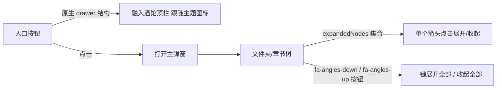

# 小说阅读器按钮 UI 对齐 + 原生一键展开/收起（基于 CFM 现成实现）

> 目标：另一个窗口 AI 完成的「酒馆小说阅读器」按钮 UI 与 CFM 不一致，且缺少「原生按钮注入 + 一键展开/收起」。本文档整理 CFM 顶部栏按钮注入、按钮 CSS、原生 UI 注入模式与一键展开/收起的**现成代码**，供小说插件直接对齐复用。
>
> 核心：CFM 的入口按钮用酒馆原生顶栏的 `drawer` 结构（与 `persona-management-button` 等原生按钮一致），因此能天然融入酒馆顶栏、跟随美化主题图标。展开/收起全部 = 维护一个 `expandedNodes` 集合 + 重渲染树。

---

## 1. 现状问题（小说插件 vs CFM）

| 对比项        | CFM（目标样式）                                                | 小说插件（待修）              |
| ------------- | -------------------------------------------------------------- | ----------------------------- |
| 顶栏按钮结构  | `#xxx .drawer .drawer-toggle .drawer-icon`（原生 drawer 结构） | 自造 div 按钮，不融入原生顶栏 |
| 图标          | `fa-solid fa-folder fa-fw` + 主题图标美化适配                  | 固定图标，不跟随主题          |
| 注入位置      | `#rightNavHolder` 前，回退 `#top-settings-holder`              | 随意 append                   |
| 一键展开/收起 | 文件夹树 `expandedNodes` 集合 + 展开/收起全部按钮              | 无                            |



---

## 2. 顶栏按钮注入（与原生按钮一致）

### 2.1 HTML 结构（原生 drawer 三件套）

来源：[`ui/toolbar/buttons.js`](ui/toolbar/buttons.js:28)：

```js
export function createTopbarButtonCore(deps) {
  const $ = deps.$;
  if ($("#cfm-topbar-button").length > 0) return; // 防重复

  const btn = $(
    `<div id="cfm-topbar-button" class="drawer">
       <div class="drawer-toggle drawer-header">
         <div class="drawer-icon closedIcon fa-solid fa-folder fa-fw interactable"
              title="酒馆资源管理器" tabindex="0" role="button"></div>
       </div>
     </div>`,
  );
  const rightNav = $("#rightNavHolder");
  if (rightNav.length > 0) rightNav.before(btn); // 插到右侧导航前面（与原生按钮并列）
  else $("#top-settings-holder").append(btn);    // 回退：顶栏设置区

  btn.find(".drawer-toggle").on("click touchend", (e) => {
    e.preventDefault();
    e.stopPropagation();
    if ($("#cfm-overlay").length > 0) { deps.closeMainPopup(); return; }
    deps.showMainPopup(); // 打开主弹窗
  });

  // 创建后延迟应用自定义图标 + 启动主题监听（等待美化主题样式加载）
  deps.setTimeout(() => {
    deps.applyTopbarIconFromConfig();
    deps.setupThemeChangeObserver();
  }, 500);
}
```

**关键点**：

- `class="drawer"` → `drawer-toggle drawer-header` → `drawer-icon closedIcon ... interactable`：**完全复用酒馆原生顶栏按钮（如 persona-management-button）的类名结构**，美化主题的 `.drawer-icon::before` 图标规则会自动作用于本按钮。
- `fa-fw`（fixed-width）保证图标宽度一致。
- `#rightNavHolder` 前插入，与「用户设定」「角色管理」等原生按钮并列。
- `tabindex="0" role="button"` 无障碍支持。

### 2.2 三个按钮模式（顶栏/悬浮/魔术棒）

来源：[`integrations/native-buttons.js`](integrations/native-buttons.js:12)：

```js
export function initButtonCore(deps) {
  const mode = deps.getButtonMode(); // "topbar" | "wand" | "floating"
  if (mode === "topbar") deps.createTopbarButton();
  else if (mode === "wand") deps.createWandButton();
  else deps.createFloatingButton();
  deps.setTimeout(() => deps.setupThemeBgBindingListener(), 500);
}
```

- **魔术棒按钮**：注入 `#extensionsMenu` 的 `.list-group-item.flex-container.flexGap5.interactable`（见 [`ui/toolbar/buttons.js`](ui/toolbar/buttons.js:653)），点击后 `$("#extensionsMenu").hide()` 再开弹窗。
- **悬浮按钮**：`#cfm-folder-button` 固定定位可拖拽（见 [`ui/toolbar/buttons.js`](ui/toolbar/buttons.js:435)）。

---

## 3. 按钮 CSS（可直接复用的样式）

来源：[`style.css`](style.css:1)：

### 3.1 顶栏按钮

```css
/* ========== 顶栏按钮 ========== */
#cfm-topbar-button {
  display: flex;
  align-items: center;
}
#cfm-topbar-button .drawer-toggle {
  display: inline-flex;
  align-items: center;
  justify-content: center;
}
```

> 顶栏按钮本身几乎不需要自定义样式——因为复用了原生 `drawer` 结构，酒馆/美化主题的 `.drawer-icon`、`.drawer-toggle` 规则自动生效。CSS 只需保证 `display:flex` 居中即可。

### 3.2 悬浮按钮（可作为小说插件无顶栏时的回退）

```css
#cfm-folder-button {
  position: fixed !important;
  z-index: 1050;
  cursor: grab;
  width: 44px;
  height: 44px;
  background-color: var(--SmartThemeBlurTintColor, #007bff);
  color: var(--SmartThemeBodyColor, white);
  border: 1px solid var(--SmartThemeBorderColor, #555);
  border-radius: 50%;
  box-shadow: 0 3px 8px rgba(0, 0, 0, 0.3);
  display: flex;
  align-items: center;
  justify-content: center;
  font-size: 20px;
  user-select: none;
  transition: box-shadow 0.2s;
}
```

### 3.3 自定义图标模式（跟随美化主题图标）

来源：[`style.css`](style.css:39)：

```css
#cfm-topbar-button .drawer-icon.cfm-custom-icon {
  min-width: 1.25em !important;
  min-height: 1.25em !important;
  display: inline-block !important;
  background-size: contain;
  background-repeat: no-repeat;
  background-position: center center;
  color: transparent !important;
  -webkit-text-fill-color: transparent !important;
  line-height: 1 !important;
  overflow: visible !important;
}
```

---

## 4. 图标美化适配（可选，但强烈推荐）

CFM 会检测邻居原生按钮（`persona-management-button`）的实际图标背景图，若用户装了美化主题（图标被替换成图片），则复制同款图标到自己按钮上，实现「顶栏图标风格统一」。

来源：[`ui/toolbar/buttons.js`](ui/toolbar/buttons.js:292)：

```js
export function applyTopbarIconFromConfigCore(deps) {
  const saved = deps.extensionSettings[deps.extensionName].customTopbarIcon || "";
  if (saved) {
    deps.applyCustomIcon(deps.toCssUrl(saved)); // 用户手动指定 URL
    return;
  }
  const result = deps.detectNeighborIcon(); // 读取邻居按钮实际样式
  if (result) {
    deps.applyCustomIcon(result.cssUrl, result.target, result.styles);
    return;
  }
  deps.clearCustomIcon(); // 无美化主题，保持默认 FA 图标
}
```

检测方式（`detectNeighborIcon`）：用 `getComputedStyle` 读邻居 `.drawer-icon` 元素的 `background-image` 和 `::before` 伪元素背景图（见 [`ui/toolbar/buttons.js`](ui/toolbar/buttons.js:62)），排除 `linear-gradient` 等渐变（`isImageIconBackground` 只认 `url()/image-set()`）。

主题切换自动监听：MutationObserver 监听 `<head>` 的 STYLE/LINK 增删 + 2 秒轮询邻居按钮样式变化（见 [`ui/toolbar/buttons.js`](ui/toolbar/buttons.js:311)）。

---

## 5. 一键展开/收起全部（文件夹树/章节树核心交互）

### 5.1 状态模型：expandedNodes 集合

小说插件阅读器的「角色/章节/聊天目录树」应维护一个 `Set` 记录展开节点，重渲染驱动 UI：

来源：[`ui/tree/tree-view.js`](ui/tree/tree-view.js:168)（角色树渲染）：

```js
function renderTreeNode(container, folderId, depth) {
  const hasChildren = getChildFolders(folderId).length > 0;
  const isExpanded = getExpandedNodes().has(folderId); // 该节点是否展开
  const indent = 10 + depth * 16;                       // 层级缩进

  const node = $(`
    <div class="cfm-tnode ${isSelected ? "cfm-tnode-selected" : ""}" data-id="${folderId}"
         style="padding-left:${indent}px;" draggable="true">
      <span class="cfm-tnode-arrow ${hasChildren ? (isExpanded ? "cfm-arrow-expanded" : "") : "cfm-arrow-hidden"}">
        <i class="fa-solid fa-caret-right"></i>
      </span>
      <span class="cfm-tnode-icon"><i class="fa-solid fa-folder${isSelected ? "-open" : ""}"></i></span>
      <span class="cfm-tnode-label">${escapeHtml(getTagName(folderId))}</span>
      <span class="cfm-tnode-count">${count}</span>
    </div>
  `);

  // 箭头点击：切换展开状态 → 重渲染
  node.find(".cfm-tnode-arrow").on("click", (e) => {
    e.stopPropagation();
    if (!hasChildren) return;
    const expandedNodes = getExpandedNodes();
    if (expandedNodes.has(folderId)) expandedNodes.delete(folderId);
    else expandedNodes.add(folderId);
    renderLeftTree();
    renderRightPane();
  });
}
```

### 5.2 树节点箭头 CSS（展开时旋转 90°）

来源：[`style.css`](style.css:235)：

```css
.cfm-tnode .cfm-tnode-arrow {
  width: 18px;
  text-align: center;
  font-size: 10px;
  opacity: 0.5;
  flex-shrink: 0;
  transition: transform 0.15s;   /* 展开动画 */
}
.cfm-tnode .cfm-tnode-arrow.cfm-arrow-expanded {
  transform: rotate(90deg);      /* caret-right 旋转成 caret-down */
}
.cfm-tnode .cfm-tnode-arrow.cfm-arrow-hidden {
  visibility: hidden;            /* 无子节点时隐藏箭头，保持对齐 */
}
```

### 5.3 展开全部 / 收起全部按钮

**按钮 HTML**（弹窗左侧栏头部 actions）：

来源：[`ui/modal/shell.js`](ui/modal/shell.js:211)：

```html
<span class="cfm-left-header-actions">
  <button id="cfm-expand-all" title="展开全部"><i class="fa-solid fa-angles-down"></i></button>
  <button id="cfm-collapse-all" title="收起全部"><i class="fa-solid fa-angles-up"></i></button>
</span>
```

**事件绑定**（核心逻辑：改集合 + 重渲染）：

来源：[`ui/modal/shell.js`](ui/modal/shell.js:1281)：

```js
// 展开全部
popup.find("#cfm-expand-all").on("click touchend", (e) => {
  e.preventDefault();
  const allIds = getFolderTagIds();           // 所有文件夹 ID
  const expandedNodes = getExpandedNodes();
  for (const id of allIds) expandedNodes.add(id);  // 全部加入展开集合
  renderLeftTree();                            // 重渲染左侧树
  renderRightPane();                           // 重渲染右侧面板
});
// 收起全部
popup.find("#cfm-collapse-all").on("click touchend", (e) => {
  e.preventDefault();
  const expandedNodes = getExpandedNodes();
  expandedNodes.clear();                       // 清空展开集合
  renderLeftTree();
  renderRightPane();
});
```

**原生 UI 注入版本**（注入到酒馆原生文件夹过滤面板的工具栏）：

来源：[`integrations/native-filters.js`](integrations/native-filters.js:543)：

```js
// 展开全部（原生面板）
toolbar.find(".cfm-nf-expand-all").on("click", function (e) {
  e.stopPropagation();
  let allIds;
  if (type === "chars") allIds = getFolderTagIds();
  else allIds = getResFolderIds(treeType);
  allIds.forEach((id) => expandedSet.add(id));
  treeContainer.html(buildNativeFolderTreeHtml(treeType, null, 0, expandedSet, currentFilter));
});
// 收起全部（原生面板）
toolbar.find(".cfm-nf-collapse-all").on("click", function (e) {
  e.stopPropagation();
  expandedSet.clear();
  treeContainer.html(buildNativeFolderTreeHtml(treeType, null, 0, expandedSet, currentFilter));
});
```

---

## 6. 原生 UI 注入模式（小说插件过滤面板可直接照搬）

CFM 会把「文件夹过滤」按钮注入到酒馆**原生列表页**（角色/预设/世界书等）搜索框旁，点击弹出浮动面板（含展开/收起全部）。这套「工具栏 + 浮动面板」结构同样适用于小说阅读器的过滤/导航面板。

来源：[`integrations/native-filters.js`](integrations/native-filters.js:475)：

```js
// 工具栏（标题 + 展开/收起全部 actions）
const toolbar = $(`<div class="cfm-nf-toolbar">
  <span class="cfm-nf-title"><i class="fa-solid fa-folder-tree"></i> 文件夹过滤</span>
  <span class="cfm-nf-toolbar-actions">
    <i class="fa-solid fa-angles-down cfm-nf-expand-all" title="展开全部"></i>
    <i class="fa-solid fa-angles-up cfm-nf-collapse-all" title="收起全部"></i>
  </span>
</div>`);
```

**面板 CSS**（来源：[`style.css`](style.css:5655)）：

```css
.cfm-nf-panel {
  position: fixed;
  z-index: 10000;
  background: var(--SmartThemeBlurTintColor, #1e1e2e);
  border: 1px solid rgba(255, 255, 255, 0.15);
  border-radius: 8px;
  box-shadow: 0 8px 32px rgba(0, 0, 0, 0.5);
  min-width: 220px;
  max-width: 320px;
  max-height: 400px;
  display: flex;
  flex-direction: column;
  overflow: hidden;
  backdrop-filter: blur(12px);
}
.cfm-nf-toolbar {
  display: flex;
  align-items: center;
  justify-content: space-between;
  padding: 8px 12px;
  border-bottom: 1px solid rgba(255, 255, 255, 0.1);
  flex-shrink: 0;
}
.cfm-nf-toolbar-actions { display: flex; gap: 8px; }
.cfm-nf-toolbar-actions i {
  cursor: pointer;
  font-size: 12px;
  opacity: 0.6;
  transition: opacity 0.2s;
}
.cfm-nf-toolbar-actions i:hover { opacity: 1; }
```

**注入按钮**（原生列表搜索框旁，用 `menu_button` 类与原生按钮一致）：

来源：[`integrations/native-filters.js`](integrations/native-filters.js:1214)：

```js
const btn = $(
  `<div class="cfm-nf-btn menu_button fa-solid fa-folder-tree" data-nf-type="chars" title="文件夹过滤"></div>`,
);
```

```css
.cfm-nf-btn {
  cursor: pointer;
  opacity: 0.7;
  transition: opacity 0.2s, color 0.2s;
  font-size: 14px;
}
.cfm-nf-btn:hover { opacity: 1; }
.cfm-nf-btn-active { opacity: 1; color: #89b4fa !important; }
```

---

## 7. 小说插件集成清单（对照修改）

| #   | 修改点                         | 参照实现                                                               | 说明                                                                         |
| --- | ------------------------------ | ---------------------------------------------------------------------- | ---------------------------------------------------------------------------- |
| 1   | 入口按钮改为原生 drawer 结构   | [`ui/toolbar/buttons.js`](ui/toolbar/buttons.js:28)                    | `#xxx.drawer` 三件套，注入 `#rightNavHolder` 前，回退 `#top-settings-holder` |
| 2   | 顶栏按钮 CSS                   | [`style.css`](style.css:27)                                            | 复用原生 drawer 类，仅需 `display:flex` 居中                                 |
| 3   | 图标美化适配                   | [`ui/toolbar/buttons.js`](ui/toolbar/buttons.js:292)                   | 读取邻居按钮背景图复制；MutationObserver + 轮询监听主题变化                  |
| 4   | 树节点展开/收起                | [`ui/tree/tree-view.js`](ui/tree/tree-view.js:168)                     | `expandedNodes` Set + 箭头点击切换 + 重渲染                                  |
| 5   | 树箭头 CSS                     | [`style.css`](style.css:235)                                           | 18px 宽、`rotate(90deg)` 展开、无子节点隐藏                                  |
| 6   | 一键展开/收起全部              | [`ui/modal/shell.js`](ui/modal/shell.js:1281)                          | `fa-angles-down`/`fa-angles-up` 按钮，改集合 + 重渲染                        |
| 7   | 原生 UI 注入                   | [`integrations/native-filters.js`](integrations/native-filters.js:475) | `menu_button` 类按钮 + `cfm-nf-panel` 浮动面板 + 工具栏 actions              |
| 8   | 面板 CSS                       | [`style.css`](style.css:5655)                                          | `cfm-nf-panel` / `cfm-nf-toolbar` / actions 样式                             |
| 9   | 三模式入口（顶栏/魔术棒/悬浮） | [`integrations/native-buttons.js`](integrations/native-buttons.js:12)  | `buttonMode` 配置：topbar/wand/floating                                      |
| 10  | 魔术棒按钮                     | [`ui/toolbar/buttons.js`](ui/toolbar/buttons.js:653)                   | 注入 `#extensionsMenu`，点击前先 `hide()` 菜单                               |

---

## 8. 关键经验总结

| 经验                                      | 说明                                                                             |
| ----------------------------------------- | -------------------------------------------------------------------------------- |
| **复用原生 drawer 结构，而非自造按钮**    | 顶栏按钮类名与原生按钮一致，美化主题的图标替换规则自动生效，UI 天然统一          |
| **展开状态 = 一个 Set，重渲染驱动**       | 不用逐个 toggle DOM，维护 `expandedNodes` 集合，改完集合后整树重渲染最稳         |
| **箭头旋转动画**                          | `fa-caret-right` + `transform: rotate(90deg)` + `transition`，成本最低的展开指示 |
| **展开/收起全部 = 全量 add / clear 集合** | 一行逻辑 + 重渲染，天然支持任意层级                                              |
| **浮动面板定位用 getBoundingClientRect**  | 锚定按钮下方，视口越界自动翻转，`stopPropagation` 防原生面板关闭                 |
| **menu_button 类 = 与原生 UI 按钮一致**   | 注入到原生界面时统一用 `menu_button`/`menu_button_icon` 类                       |
| **主题图标适配要防抖 + 兜底轮询**         | MutationObserver 监听 STYLE/LINK 变化 + 2s 轮询邻居按钮，主题切换后图标自动跟随  |

---

## 9. 小说插件一键展开/收起适配建议（针对阅读器场景）

小说阅读器的「章节树/聊天目录树」与 CFM 文件夹树同构，直接套用第 5 节模式：

1. **数据结构**：把「角色 → 聊天 → 消息」组织成树，节点 ID 用 `chat_name` 或 `avatar+chat` 拼接。
2. **展开状态**：`const expandedNodes = new Set()`，默认展开当前阅读的聊天所属节点。
3. **单个箭头**：`cfm-tnode-arrow` 结构 + 点击切换集合 + 重渲染（原样照抄 [`ui/tree/tree-view.js`](ui/tree/tree-view.js:215)）。
4. **一键展开/收起**：阅读器弹窗头部加 `fa-angles-down`/`fa-angles-up` 两个按钮，分别执行「所有角色 ID 加入集合」/「清空集合」+ 重渲染（原样照抄 [`ui/modal/shell.js`](ui/modal/shell.js:1281)）。
5. **图标**：入口按钮用 `fa-solid fa-book fa-fw`（书图标），其余结构与 CFM 完全一致。
