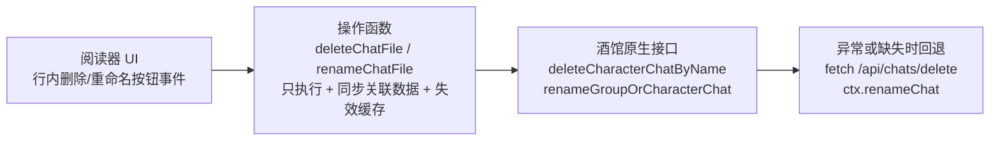

# 酒馆小说阅读器参考文档：单条聊天记录删除与重命名及操作后同步（最小版）

> 本文档基于 CFM（酒馆资源管理器）代码，聚焦**阅读器最需要的单条聊天删除/重命名 + 操作后同步**。
> 阅读器**没有文件夹分类、置顶、批量功能**，因此本文档已剔除 CFM 中批量重命名（`executeChatlogRename`）、文件夹分组迁移（`chatGroups`）、置顶聊天（`pinnedChats`）等与阅读器无关的复杂度，只保留单条操作可直接照搬的最小实现。
> 所有行号对应仓库当前代码。

## 1. 最小架构总览

阅读器只需要两层即可照搬 CFM 的核心模式：



- **操作函数保持纯净**：删除/重命名函数本身**不负责重绘 UI**，只做「执行 + 清理/迁移关联数据 + 缓存失效 + 返回 true/false」。重绘由调用方（UI 事件处理器）成功后触发（[`features/chatlogs/rename.js`](features/chatlogs/rename.js:75)）。
- **双保险调用**：优先酒馆原生函数，异常或缺失时回退 HTTP API / 上下文方法。

## 2. 单条聊天删除

### 2.1 核心删除函数 deleteChatFile

位于 [`features/chatlogs/import-export.js`](features/chatlogs/import-export.js:28)，完整流程：

```
deleteChatFile(avatar, chatFileName)
├─ 1. 查角色索引：getCharacters().findIndex(c => c.avatar === avatar)，找不到返回 false
├─ 2. 去扩展名：fileNameNoExt = chatFileName.replace(/\.jsonl$/i, "")
├─ 3. 调用原生接口（优先）：
│     deleteCharacterChatByNameFunc(String(charIdx), fileNameNoExt)
│     └─ 若抛异常 → console.warn 后回退 fetch /api/chats/delete
│        （body: { chatfile: fileNameNoExt + ".jsonl", avatar_url: avatar }）
│  └─ 若无原生接口 → 直接 fetch /api/chats/delete
├─ 4. 删除成功后同步清理：
│     ├─ 备注：state.cfmChatNotes[fileNameNoExt] 存在则 delete + saveChatNotes()
│     └─ 缓存失效：await invalidateChatCache(avatar)
└─ 返回 deleted
```

关键点：

- **双保险调用**：优先用原生 `deleteCharacterChatByName`，异常时回退 HTTP API。注意原生接口与 API 对文件名扩展名的要求不同（原生不要 `.jsonl`，API 要完整名），代码分别处理（[`features/chatlogs/import-export.js`](features/chatlogs/import-export.js:34)）。
- **删除成功后立即做清理**：备注 + 缓存失效。这两处是删除后同步的核心。（CFM 额外清理「批量选中集合」，阅读器无批量功能，可忽略。）

### 2.2 删除当前正在阅读的聊天 → 自动建新聊天

CFM 删除当前聊天时，**在删除前（而不是删除后）捕获当前聊天 ID**，避免删完就取不到：

```js
const ctxBeforeBatchDel = deps.getContext();
const curChatIdBeforeBatchDel = ctxBeforeBatchDel.getCurrentChatId?.() ?? null;
const currentCharAvatarBeforeBatchDel = deps.getCurrentCharAvatar();
// 循环中判断是否删除的是当前聊天，删除成功后置标记
```

删除循环结束后：

```js
deps.saveSettingsDebounced();
if (deletedCurrentChat && deps.doNewChatFunc) {
  await deps.doNewChatFunc();          // 调用酒馆 doNewChat 自动新建聊天
  deps.toastr.info("已自动创建新聊天");
}
```

出处：[`features/folders/delete.js`](features/folders/delete.js:426)。`doNewChatFunc` 来自酒馆 `doNewChat`，见 [`integrations/sillytavern.js`](integrations/sillytavern.js:37)。

**阅读器适配**：删除正在阅读的聊天后，应「先记录当前聊天 ID → 删除 → 若删的是当前项则 `doNewChatFunc()` 新建或跳转到下一本」，保证用户不会停留在已删除的聊天上。

### 2.3 删除后同步动作（最小版）

| 入口                   | 位置       | 删除后同步动作                                                                     |
| ---------------------- | ---------- | ---------------------------------------------------------------------------------- |
| 阅读器列表行内删除按钮 | 阅读器自建 | `cfmConfirm` 二次确认 → `deleteChatFile` → 成功后 toastr + `rerenderCurrentView()` |

**统一规律**：所有 UI 入口在 `deleteChatFile` 成功后都调用 `rerenderCurrentView()` 重绘（[`index.js`](index.js:3497) 会按当前资源类型分派到对应视图渲染函数）。

## 3. 单条聊天重命名

### 3.1 单条重命名核心 renameChatFile

位于 [`features/chatlogs/rename.js`](features/chatlogs/rename.js:75)：

```
renameChatFile(avatar, oldFileName, newName)
├─ 1. 查角色索引，找不到返回 false
├─ 2. 去扩展名：oldNameNoExt / newNameNoExt（renameGroupOrCharacterChat 期望不带 .jsonl）
├─ 3. 调用原生接口（优先）：
│     renameGroupOrCharacterChatFunc({
│       characterId: String(charIdx), groupId: null,
│       oldFileName: oldNameNoExt, newFileName: newNameNoExt, loader: false,
│     })
│  └─ 若无该函数 → 回退 ctx.renameChat(oldNameNoExt, newNameNoExt)
│     └─ 若当前打开的聊天不是旧聊天（needSwitchContext），先 openCharacterChatFunc 切换到旧聊天再重命名
├─ 4. 迁移备注（备注 key 统一为不带 .jsonl 的文件名）：
│     if (state.cfmChatNotes[oldNameNoExt]) {
│       state.cfmChatNotes[newNameNoExt] = state.cfmChatNotes[oldNameNoExt];
│       delete state.cfmChatNotes[oldNameNoExt];
│       saveChatNotes();
│     }
├─ 5. await invalidateChatCache(avatar)
└─ 返回 true / false
```

关键点：

- **回退分支的上下文切换**：`ctx.renameChat` 只能重命名「当前打开的聊天」，所以旧聊天不是当前聊天时，要先 `openCharacterChatFunc` 切过去再改名，改完再切回。原生 `renameGroupOrCharacterChatFunc` 则无此限制（[`features/chatlogs/rename.js`](features/chatlogs/rename.js:96)）。
- **备注迁移**：重命名后把旧 key 的备注搬到新 key 下再删除旧 key，并 `saveChatNotes()` 持久化。
- **缓存失效**：与删除一致，最后调用 `invalidateChatCache(avatar)`。

### 3.2 各入口的重命名调用（最小版）

| 入口                     | 位置                                                         | 重命名后同步动作                                                                      |
| ------------------------ | ------------------------------------------------------------ | ------------------------------------------------------------------------------------- |
| 聊天子列表行内重命名按钮 | [`ui/views/chat-sublist.js`](ui/views/chat-sublist.js:373)   | `showChatRenamePopup` 弹窗 → `renameChatFile` → 成功 toastr + `rerenderCurrentView()` |
| 聊天记录页行内重命名按钮 | [`ui/views/chatlogs-view.js`](ui/views/chatlogs-view.js:433) | `renameChatFile` → 成功后 `renderChatlogsView()`                                      |

**阅读器适配**：只需保留 `showChatRenamePopup` 弹窗（[`features/chatlogs/rename.js`](features/chatlogs/rename.js:173) 附近）与 `renameChatFile` 单条调用，CFM 的批量重命名三种模式（single/batch/individual）与 `chatGroups` 分组迁移全部不需要。

## 4. 操作后同步机制详解（最小版）

这是小说阅读器最需要复用的部分。CFM 的操作后同步分三类：

### 4.1 缓存失效与预加载（invalidateChatCache）

位于 [`features/chatlogs/cache.js`](features/chatlogs/cache.js:67)：

```js
async function invalidateChatCache(avatar) {
  state.cfmChatCache.delete(avatar);   // 1. 删除该角色的聊天列表缓存
  await getCharChats(avatar);          // 2. 立即重新拉取，避免 UI 重绘时列表数据缺失
}
```

- 缓存是 `Map<avatar, chats[]>`（[`index.js`](index.js:8248)）。
- **立即重载**而非只删除缓存：注释说明「避免后续 rerenderCurrentView 时三角箭头消失」——先删后立即拉，保证重绘时数据已就绪（[`features/chatlogs/cache.js`](features/chatlogs/cache.js:69)）。
- 数据获取优先走酒馆 `getPastCharacterChats` 原生函数，否则回退 `fetch /api/characters/chats` POST（body: `{ avatar_url }`）（[`features/chatlogs/cache.js`](features/chatlogs/cache.js:20)）。

**阅读器适配**：阅读器需要有「当前角色的聊天列表」缓存，删除/重命名后调用 `invalidateChatCache` 让列表数据就绪，再重绘。

### 4.2 UI 重绘（rerenderCurrentView）

```js
function rerenderCurrentView() {
  if (currentResourceType === "chars") renderRightPane();
  else if (currentResourceType === "chatlogs") renderChatlogsView();
  // ...
}
```

出处：[`index.js`](index.js:3497)。**注意**：操作函数（`deleteChatFile` / `renameChatFile`）本身**不负责重绘**，重绘由调用方（UI 事件处理器）在成功后触发。这使功能层保持纯粹、可复用。

### 4.3 持久化（saveSettingsDebounced / saveChatNotes）

- **插件设置**：`getContext().saveSettingsDebounced()`（酒馆的防抖保存）。
- **聊天备注**：`saveChatNotes()` 将 `state.cfmChatNotes` 写回 `extensionSettings[extensionName].chatNotes` 并调用 `saveSettingsDebounced()`（[`features/chatlogs/notes.js`](features/chatlogs/notes.js:27)）。

**阅读器适配**：如果阅读器有「书架/收藏/阅读进度」等元数据，删除聊天时同步清理对应条目、重命名时同步迁移 key，最后统一 `saveSettingsDebounced()` 持久化。

### 4.4 原生事件监听（被动同步，可选）

CFM 没有拦截酒馆原生的删除/重命名（不监听 `CHAT_DELETED` 等事件），而是：

- 监听 `event_types.CHAT_CHANGED`，用于「角色/聊天切换时把聊天记录页同步到当前角色」：若弹窗打开且当前在聊天记录页，则 `renderChatlogsView()`（[`index.js`](index.js:17894)）。**延迟 300ms** 确保角色信息已更新。

**对小说阅读器的启示**：如果阅读器需要同步「用户在其他界面删除/重命名了聊天」后的书架/收藏，建议监听 `event_types.CHAT_CHANGED` + 定期失效缓存重拉列表。若阅读器不依赖外部元数据，此条可省略。

## 5. 对小说阅读器的复用建议（最小版）

| CFM 模式                                           | 小说阅读器对应需求          | 复用要点                                                 |
| -------------------------------------------------- | --------------------------- | -------------------------------------------------------- |
| `deleteChatFile` 双保险调用 + 成功后清理           | 阅读器删除单条聊天          | 原生函数优先 + fetch 回退；成功后清理关联数据 + 缓存失效 |
| 删除前捕获当前聊天 + `doNewChatFunc` 兜底          | 删除正在阅读的聊天后跳转    | 先记录当前项再删，删完自动切换到新项                     |
| `renameChatFile` 备注迁移                          | 重命名单条聊天后迁移元数据  | 同步迁移 key 关联数据 + 持久化                           |
| `invalidateChatCache` 删后立即重载                 | 阅读器列表刷新              | 删缓存后 await 重新拉取，避免 UI 闪烁                    |
| 功能层不负责重绘，调用方触发 `rerenderCurrentView` | 阅读器列表重绘              | 保持功能层纯净，UI 层统一重绘                            |
| `cfmConfirm` 二次确认                              | 删除/重命名前的危险操作确认 | 破坏性操作统一走确认弹窗再执行                           |
| `showChatRenamePopup` 弹窗                         | 重命名输入弹窗              | 单条重命名直接复用，不引入批量模式                       |

## 6. 关键代码行号速查（最小版）

| 功能点                                     | 文件                               | 行号    |
| ------------------------------------------ | ---------------------------------- | ------- |
| 单条删除核心 `deleteChatFile`              | features/chatlogs/import-export.js | 28      |
| 原生删除接口回退 fetch /api/chats/delete   | features/chatlogs/import-export.js | 47-70   |
| 删除后清理备注/缓存                        | features/chatlogs/import-export.js | 72-81   |
| 打开聊天 `openChatFile`（选中角色+切聊天） | features/chatlogs/import-export.js | 204     |
| 单条重命名 `renameChatFile`                | features/chatlogs/rename.js        | 75      |
| 重命名回退 ctx.renameChat + 上下文切换     | features/chatlogs/rename.js        | 96-100  |
| 重命名输入弹窗 `showChatRenamePopup`       | features/chatlogs/rename.js        | 173     |
| 备注持久化 `saveChatNotes`                 | features/chatlogs/notes.js         | 27      |
| 缓存失效与预加载 `invalidateChatCache`     | features/chatlogs/cache.js         | 67      |
| 缓存数据获取（原生函数 / fetch 回退）      | features/chatlogs/cache.js         | 12-62   |
| 视图重绘分派 `rerenderCurrentView`         | index.js                           | 3497    |
| 聊天记录视图渲染 `renderChatlogsView`      | index.js                           | 13372   |
| 删除当前聊天后自动建新聊天                 | features/folders/delete.js         | 426-469 |
| CHAT_CHANGED 被动同步聊天记录页            | index.js                           | 17894   |
| 聊天列表缓存定义 cfmChatCache              | index.js                           | 8248    |

## 7. 复用注意事项（最小版）

1. **功能层保持纯净**：`deleteChatFile` / `renameChatFile` 只做「执行 + 同步关联数据 + 缓存失效」，不直接重绘 UI；重绘统一由调用方触发。小说阅读器的增删改函数建议同样拆分。
2. **文件名扩展名约定**：插件内部统一用「不带 `.jsonl`」作为 key（备注、缓存），仅在调用酒馆原生接口/HTTP API 边界处补扩展名。阅读器若有类似「key 归一化」需求，建议统一入口做转换（可参考 [`features/chatlogs/api.js`](features/chatlogs/api.js:3) 的 `splitChatlogFileName`）。
3. **双保险 + 异常降级**：优先原生函数、异常或缺失时回退 HTTP API，每步失败都有 console 日志与 toastr 提示，保证用户可感知。
4. **删除关联数据的完整性**：删除/重命名后要同步清理或迁移「备注、缓存」等关联数据，避免脏数据残留。小说阅读器应在删除聊天时同步清理其书架/收藏条目。
5. **持久化统一走 `saveSettingsDebounced`**：所有内存对象改动后最后统一防抖保存，避免频繁写盘。
