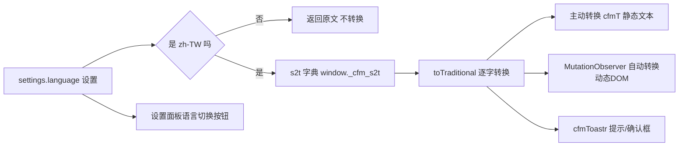

# 简繁中文切换（S2T）代码与实现

> 目标：供「酒馆小说阅读器」新插件复用——如何实现界面简体/繁體切换、如何对动态渲染的 DOM 自动转换、如何加载转换字典。
>
> 核心结论一句话：**加载一个逐字对照字典（[`s2t.js`](s2t.js)，2606 对字符），设置里存 `language: "zh-CN" | "zh-TW"`，用「主动转换 + MutationObserver 自动转换」两套机制让整个界面（含动态弹窗）随设置切换。**

---

## 1. 架构与数据流



三个文件分工：

- [`s2t.js`](s2t.js:1)：纯字典 + 转换函数，自包含 IIFE，挂 `window._cfm_s2t`，**零依赖、可直接复制**（A 类复用）
- [`features/i18n/language.js`](features/i18n/language.js:3)：`cfmTCore` —— 判断语言设置并调转换
- [`features/i18n/s2t-bridge.js`](features/i18n/s2t-bridge.js:12)：`cfmConvertDomTextCore`（遍历 DOM 文本节点转换）+ `initCfmS2tObserverCore`（MutationObserver 自动转换）

---

## 2. 转换字典 s2t.js（A 类：整文件复制）

来源：[`s2t.js`](s2t.js:5)（约 120 行，文件本体含 2606 对简繁字符表，复制时整文件拷走即可）

```js
// 简繁中文逐字对照转换字典 (CFM S2T Module)
// 通过 <script> 加载，挂载到 window._cfm_s2t
// S[i] <-> T[i]，仅包含简繁不同的字符，由 opencc 自动生成，共 2606 对
(function () {
  var S = "万与丑专业丛东丝丢两严丧个丰临为丽举么义乌乐乔习乡书买乱争于亏云亘亚产亩亲亵..."; // 2606 个简体字
  var T = "萬與醜專業叢東絲丟兩嚴喪個豐臨爲麗舉麼義烏樂喬習鄉書買亂爭於虧雲亙亞產畝親褻..."; // 2606 个对应繁体字
  var s2tMap = null, t2sMap = null;

  function build() {
    if (s2tMap) return;
    s2tMap = {}; t2sMap = {};
    var sa = [...S], ta = [...T];
    for (var i = 0; i < sa.length; i++) {
      s2tMap[sa[i]] = ta[i];
      t2sMap[ta[i]] = sa[i];
    }
  }

  function toTraditional(text) {
    if (!text) return text;
    build();
    var r = "";
    for (var c of text) r += s2tMap[c] || c;
    return r;
  }
  function toSimplified(text) {
    if (!text) return text;
    build();
    var r = "";
    for (var c of text) r += t2sMap[c] || c;
    return r;
  }

  window._cfm_s2t = { toTraditional: toTraditional, toSimplified: toSimplified };
})();
```

**特性与注意**：

- **逐字对照**：非词组、无「一简对多繁」上下文判断（如「发」→「發/髮」无法区分，但日常插件 UI 文案基本可接受）
- **懒构建**：首次调用才 build 映射表，不阻塞加载
- **双向可用**：既提供简→繁也提供繁→简
- **挂载契约**：`window._cfm_s2t = { toTraditional, toSimplified }`，加载方以此判断字典是否可用
- **复用建议**：整文件复制到新插件目录，**无需任何改动**

---

## 3. 文本转换封装 cfmTCore

来源：[`features/i18n/language.js`](features/i18n/language.js:3)（完整 14 行）

```js
export function cfmTCore(text, deps = {}) {
  if (!text) return text;
  const extensionSettings = typeof deps.getExtensionSettings === "function"
    ? deps.getExtensionSettings()
    : deps.extensionSettings;
  const ext = extensionSettings?.[deps.extensionName];
  if (ext?.language !== "zh-TW") return text;  // 非繁体设置直接返回原文
  return deps.s2t?.toTraditional?.(text) ?? text; // 字典缺失时返回原文
}
```

**设计要点**：

- **开关判定**：只有 `extensionSettings[extensionName].language === "zh-TW"` 才转换，其余（含未设置）一律原样返回
- **防御式**：`s2t` 不存在时 `?? text` 兜底，不抛错
- **依赖注入**：`getExtensionSettings`/`extensionSettings` 两种取法，兼容同步注入与函数注入

---

## 4. DOM 自动转换 s2t-bridge.js（B 类：复制精简）

### 4.1 转换判定

来源：[`features/i18n/s2t-bridge.js`](features/i18n/s2t-bridge.js:3)

```js
export function isTraditionalChineseEnabled(deps = {}) {
  const extensionSettings = typeof deps.getExtensionSettings === "function"
    ? deps.getExtensionSettings()
    : deps.extensionSettings;
  return extensionSettings?.[deps.extensionName]?.language === "zh-TW";
}
```

### 4.2 遍历 DOM 文本节点转换

来源：[`features/i18n/s2t-bridge.js`](features/i18n/s2t-bridge.js:12)

```js
export function cfmConvertDomTextCore(root, deps = {}) {
  const extensionSettings = typeof deps.getExtensionSettings === "function"
    ? deps.getExtensionSettings()
    : deps.extensionSettings;
  const ext = extensionSettings?.[deps.extensionName];
  if (!ext || ext.language !== "zh-TW") return;
  const s2t = deps.s2t;
  if (!s2t?.toTraditional) return;
  const doc = deps.document || document;
  const walker = doc.createTreeWalker(root, deps.NodeFilter?.SHOW_TEXT ?? NodeFilter.SHOW_TEXT);
  let node;
  const toConv = [];
  while ((node = walker.nextNode())) {
    // 排除标记了 data-cfm-no-convert 的元素（如语言切换按钮本身）
    const el = node.parentElement;
    if (el && el.closest?.("[data-cfm-no-convert]")) continue;
    const t = node.nodeValue || "";
    if (!/[\u4e00-\u9fff]/.test(t)) continue; // 无汉字跳过
    toConv.push(node);
  }
  // 先收集后修改，避免遍历中变更影响 TreeWalker
  for (const n of toConv) {
    n.nodeValue = s2t.toTraditional(n.nodeValue);
  }
  // 属性值也需要转换（placeholder / title / aria-label）
  const attrs = ["placeholder", "title", "aria-label"];
  if (root.querySelectorAll) {
    root.querySelectorAll("[placeholder],[title],[aria-label]").forEach((el) => {
      if (el.closest?.("[data-cfm-no-convert]")) return;
      for (const a of attrs) {
        if (el.hasAttribute(a) && /[\u4e00-\u9fff]/.test(el.getAttribute(a) || "")) {
          el.setAttribute(a, s2t.toTraditional(el.getAttribute(a)));
        }
      }
    });
  }
}
```

**要点**：

- `TreeWalker SHOW_TEXT` 遍历文本节点，`/[\u4e00-\u9fff]/` 正则只处理含汉字的节点（性能）
- **先收集后修改**：避免转换过程中改变 nodeValue 干扰 walker 遍历
- **排除属性**：`data-cfm-no-convert` 的元素整个跳过（含子树）
- **属性也转**：`placeholder`/`title`/`aria-label` 是 UI 常用文本载体

### 4.3 MutationObserver 自动转换

来源：[`features/i18n/s2t-bridge.js`](features/i18n/s2t-bridge.js:55)

```js
export function initCfmS2tObserverCore(deps = {}) {
  const doc = deps.document || document;
  const isCfmElement = (node) =>
    node?.id?.startsWith("cfm-") ||
    (typeof node?.className === "string" && node.className.includes("cfm-"));
  const isInsideCfm = (node) => {
    if (!node) return false;
    if (node.nodeType === 3) node = node.parentElement; // 文本节点取其父元素
    return isCfmElement(node) || !!node?.closest?.("[id^='cfm-'],[class*='cfm-']");
  };
  const convertDomText = deps.convertDomText || cfmConvertDomTextCore;
  const convert = (root) => {
    if (!isTraditionalChineseEnabled(deps)) return;
    try { convertDomText(root, deps); } catch (e) { /* 忽略单次转换错误 */ }
  };

  const observer = new (deps.MutationObserver || MutationObserver)((mutations) => {
    if (deps.converting) return; // 防回环：转换过程中忽略新 mutation
    deps.converting = true;
    try {
      for (const m of mutations) {
        for (const n of m.addedNodes) {
          if (n.nodeType === 1 || n.nodeType === 3) {  // 元素或文本
            if (isInsideCfm(n)) convert(n);           // 只处理 CFM 范围
          }
        }
        if (m.type === "characterData" && isInsideCfm(m.target)) {
          convert(m.target.parentElement || m.target);
        }
      }
    } finally {
      deps.converting = false;
    }
  });

  const start = () => {
    if (doc.body) {
      observer.observe(doc.body, {
        childList: true, subtree: true, characterData: true,
      });
    }
  };
  if (doc.readyState === "loading") {
    doc.addEventListener("DOMContentLoaded", start, { once: true });
  } else {
    start();
  }
  return observer;
}
```

**要点（防回环 + 范围限定）**：

- **`converting` 标志**：转换会修改 DOM → 触发新的 mutation → 再次转换 → 无限循环。标志位在转换期间置真，忽略期间的所有 mutation
- **范围限定**：只处理 `id^="cfm-"` 或 `class*="cfm-"` 的节点/子树，**不污染酒馆其他 UI**
- **监听 body**：childList + subtree + characterData，能覆盖任何动态插入的弹窗/面板
- **懒启动**：DOMContentLoaded 后才 observe

---

## 5. 装配层 index.js（加载 + 包装）

来源：[`index.js`](index.js:538)（L538-648，核心段落完整代码）

### 5.1 动态加载 s2t.js（4 策略推断路径）

```js
// ==================== 简繁转换模块加载 ====================
// 注意：SillyTavern 以 type="module" 加载扩展 JS，document.currentScript 在模块中始终为 null
// 因此通过多种降级策略推断实际文件夹路径
try {
  let s2tUrl = "";
  if (_cfmCurrentScriptSrc) {
    // 策略1：从 document.currentScript.src 推断（非 module 模式下有效）
    s2tUrl = _cfmCurrentScriptSrc.replace(/\/[^\/]*$/, "/s2t.js");
  } else {
    // 策略2：从 DOM 中已加载的本扩展 <script> 标签推断
    const selfScript = document.querySelector(
      'script[src*="Folder-Manager"][src$="index.js"]',
    );
    if (selfScript) {
      s2tUrl = selfScript.src.replace(/\/[^\/]*$/, "/s2t.js");
    } else {
      // 策略3：从已加载的 CSS <link> 标签推断
      const cssLink = document.querySelector(
        'link[href*="Folder-Manager"][href$="style.css"]',
      );
      if (cssLink) {
        s2tUrl = cssLink.href.replace(/style\.css$/, "s2t.js");
      } else {
        // 策略4：最终降级使用硬编码路径
        s2tUrl = `/${extensionFolderPath}/s2t.js`;
      }
    }
  }
  const s2tScript = document.createElement("script");
  s2tScript.src = s2tUrl;
  document.head.appendChild(s2tScript);
  await new Promise((resolve, reject) => {
    s2tScript.onload = resolve;
    s2tScript.onerror = () => {
      console.warn("[CFM] s2t.js 加载失败，简繁转换不可用，尝试路径:", s2tUrl);
      resolve(); // 不阻塞主流程
    };
  });
} catch (e) {
  console.warn("[CFM] 加载简繁转换字典异常:", e);
}
```

> ⚠️ **新插件必须改的两处**：
>
> 1. 选择器 `'script[src*="Folder-Manager"]...'` 与 `'link[href*="Folder-Manager"]...'` 里的 `Folder-Manager` 换成你的文件夹名关键词（如 `NOVEL-READER`）
> 2. `extensionFolderPath` 变量值换成你的文件夹名

### 5.2 包装函数（cfmT / cfmConvertDomText / cfmToastr / cfmConfirm）

```js
// 将简体中文文本转换为繁体中文（如果当前设置为繁体）
function cfmT(text) {
  return cfmTCore(text, {
    extensionName,
    getExtensionSettings: () =>
      typeof getContext === "function" ? getContext().extensionSettings : {},
    s2t: window._cfm_s2t,
  });
}

// 遍历 DOM 子树中的所有文本节点，执行简繁转换
function cfmConvertDomText(root) {
  return cfmConvertDomTextCore(root, {
    extensionName,
    getExtensionSettings: () =>
      typeof getContext === "function" ? getContext().extensionSettings : {},
    s2t: window._cfm_s2t,
    document,
    NodeFilter,
  });
}

// CFM 专用 toastr 包装（自动简繁转换，不影响酒馆其他组件）
const cfmToastr = {
  success: (msg, title, ...rest) =>
    toastr.success(cfmT(msg), title ? cfmT(title) : title, ...rest),
  info: (msg, title, ...rest) =>
    toastr.info(cfmT(msg), title ? cfmT(title) : title, ...rest),
  warning: (msg, title, ...rest) =>
    toastr.warning(cfmT(msg), title ? cfmT(title) : title, ...rest),
  error: (msg, title, ...rest) =>
    toastr.error(cfmT(msg), title ? cfmT(title) : title, ...rest),
};

// CFM 专用 confirm 包装（自动简繁转换）
function cfmConfirm(msg) {
  return cfmConfirmCore(msg, {
    confirm: window.confirm.bind(window),
    translate: cfmT,
  });
}

// ==================== 全局 MutationObserver：自动简繁转换 ====================
// 监听 body 下 CFM 相关 overlay/popup 的插入与内容变化，自动转换文本
function initCfmS2tObserver() {
  return initCfmS2tObserverCore({
    extensionName,
    getExtensionSettings: () =>
      typeof getContext === "function" ? getContext().extensionSettings : {},
    s2t: window._cfm_s2t,
    convertDomText: cfmConvertDomText,
    document,
    MutationObserver,
  });
}

initCfmS2tObserver(); // 启动全局自动转换
```

**核心收益**：

- **cfmT 用于所有动态生成的 HTML 字符串**：任何 `$(`...${文本}...`)` 的地方文本都先过 cfmT
- **cfmToastr 替代 toastr**：全局替换一次，所有提示自动繁体化
- **observer 负责懒转换**：弹窗内先渲染简体再被自动转换，无需在每次弹窗创建处手动调用

---

## 6. 设置面板语言切换

来源：[`settings/render/section.js`](settings/render/section.js:528)（`renderLanguageSwitchSection`，完整代码）

```js
// ==================== 共享：界面语言切换（简体/繁体中文） ====================
function renderLanguageSwitchSection(body) {
  const current = extension_settings[extensionName].language || "zh-CN";
  const isTW = current === "zh-TW";
  const section = $(`
    <div class="cfm-config-section" data-cfm-no-convert>
      <label>${isTW ? "介面語言" : "界面语言"}</label>
      <div style="display:flex;gap:8px;margin-top:6px;">
        <button class="cfm-lang-btn menu_button ${!isTW ? "cfm-mode-active" : ""}" data-lang="zh-CN" style="flex:1;">简体中文</button>
        <button class="cfm-lang-btn menu_button ${isTW ? "cfm-mode-active" : ""}" data-lang="zh-TW" style="flex:1;">繁體中文</button>
      </div>
      <div class="cfm-icon-config-hint">${isTW ? "切換插件介面顯示的中文字體。切換後需重新打開插件生效。" : "切换插件界面显示的中文字体。切换后需重新打开插件生效。"}</div>
    </div>
  `);
  section.find(".cfm-lang-btn").on("click touchend", function (e) {
    if (e.type === "touchend") e.preventDefault();
    const lang = $(this).data("lang");
    if (lang === (extension_settings[extensionName].language || "zh-CN")) return;
    extension_settings[extensionName].language = lang;
    getContext().saveSettingsDebounced();
    section.find(".cfm-lang-btn").removeClass("cfm-mode-active");
    $(this).addClass("cfm-mode-active");
    cfmToastr.success(
      lang === "zh-TW"
        ? "已切換為繁體中文，重新打開插件後生效"
        : "已切换为简体中文，重新打开插件后生效",
    );
  });
  body.append(section);
}
```

**要点**：

- **`data-cfm-no-convert` 防自我转换**：按钮文字「简体中文/繁體中文」与提示文案若被自动转换，`${isTW ? ... : ...}` 的二次渲染与选择器判断会错乱，必须标记排除
- **当前语言高亮**：`cfm-mode-active` class 标记当前选中按钮
- **保存时机**：点击立即写 `extension_settings` + `saveSettingsDebounced()`，重启插件后生效（text 转换在加载时读取设置）

### 默认值

来源：[`settings/defaults.js`](settings/defaults.js:87)

```js
// 界面语言："zh-CN"(简体中文，默认) | "zh-TW"(繁体中文)
if (!settings.language) settings.language = "zh-CN";
```

---

## 7. 排查清单（新插件集成时逐项核对）

- [ ] `s2t.js` 已复制到新插件目录，且 `window._cfm_s2t` 挂载成功（DevTools 里 `typeof window._cfm_s2t`）
- [ ] 路径推断的 `Folder-Manager` 选择器已换成新插件文件夹名关键词
- [ ] `extensionFolderPath` 变量已换成新插件文件夹名
- [ ] 设置里已初始化 `language: "zh-CN"`（defaults）
- [ ] 所有动态 HTML 字符串文本经 `cfmT()` 包裹
- [ ] 所有 `toastr.*` 调用替换为 `cfmToastr.*`
- [ ] `cfmConfirm` 替换所有 `confirm()`
- [ ] 新弹窗根节点带 `cfm-` 前缀 id/class（否则 observer 不转换）
- [ ] 语言切换按钮所在面板带 `data-cfm-no-convert`
- [ ] 启动时调用了 `initCfmS2tObserver()`
- [ ] 验证繁体模式：切到 zh-TW → 重启 → 新弹窗文本为繁体、酒馆原生 UI 不受影响

---

## 8. 文件速查

| 文件                                                         | 行号     | 作用                                                 | 复用类别     |
| ------------------------------------------------------------ | -------- | ---------------------------------------------------- | ------------ |
| [`s2t.js`](s2t.js)                                           | 全文件   | 2606 对简繁逐字对照字典 + toTraditional/toSimplified | A 整文件复制 |
| [`features/i18n/language.js`](features/i18n/language.js)     | L1-14    | cfmTCore 文本转换开关                                | B 复制精简   |
| [`features/i18n/s2t-bridge.js`](features/i18n/s2t-bridge.js) | L3-53    | isTraditionalChineseEnabled + cfmConvertDomTextCore  | B 复制精简   |
| [`features/i18n/s2t-bridge.js`](features/i18n/s2t-bridge.js) | L55-117  | initCfmS2tObserverCore 自动转换                      | B 复制精简   |
| [`index.js`](index.js)                                       | L538-583 | 路径推断 + 动态加载 s2t.js                           | C 参考重写   |
| [`index.js`](index.js)                                       | L590-648 | cfmT/cfmToastr/cfmConfirm/observer 装配              | C 参考重写   |
| [`settings/render/section.js`](settings/render/section.js)   | L528-558 | renderLanguageSwitchSection 设置面板                 | C 参考重写   |
| [`settings/defaults.js`](settings/defaults.js)               | L87-88   | language 默认值                                      | C 参考重写   |

---

## 9. 对「小说阅读器」的适配建议

1. **直接复用整包**：`s2t.js` 原样复制，`language.js` + `s2t-bridge.js` 两个 Core 文件原样复制（仅换 deps 注入名）
2. **小说正文也可能要转**：小说阅读器渲染的**聊天正文**也是界面文本，统一走 observer 自动转换即可；若想**正文保持原文**（用户可能想读原文语言），可在正文容器加 `data-cfm-no-convert` 实现「界面繁体 + 正文原文」的混合模式
3. **性能注意**：长聊天记录一次渲染大量文本，TreeWalker 逐字符映射在数千行时可能卡顿；可对正文容器跳过自动转换，仅转面板/按钮/提示（正文不转反而更符合「读小说」场景）
4. **路径推断可简化**：新插件若确定单文件入口，可只用策略 2+4；但保留 4 策略更稳（酒馆可能以不同方式加载）
5. **语言设置迁移**：新插件用自己 extensionName 存 `language`，不要复用 CFM 的 key，避免两个插件互相干扰

---

## 10. 关键经验总结

| 经验                   | 说明                                                                       |
| ---------------------- | -------------------------------------------------------------------------- |
| **字符级映射够用**     | 插件 UI 文案无生僻多义词，2606 对逐字映射即可；不需要 opencc 词组级转换    |
| **加载必须非阻塞**     | s2t.js 失败只 warn 不阻塞插件主流程，字典缺失时所有转换函数 `?? text` 兜底 |
| **防回环是必须的**     | MutationObserver 改 DOM 会再触发 mutation，`converting` 标志是标准解法     |
| **范围限定防污染**     | 只转自己命名空间（cfm- 前缀）的节点，避免把酒馆原生 UI 也转了              |
| **排除属性防自伤**     | 语言切换按钮本身必须 `data-cfm-no-convert`，否则按钮文字被转后用户无法识别 |
| **懒转换优于手动转换** | observer 统一兜底，新弹窗无需记得手动调用转换                              |
| **正文可特殊化**       | 小说正文建议排除自动转换，保证原文阅读体验，界面元素转繁即可               |
