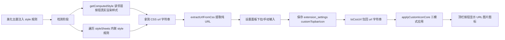

# 顶栏图标 URL 型处理专项

> 场景：美化主题（美化顶栏图标）用 `background-image: url("https://...png")` 这种 **URL 型**方式替换顶栏按钮图标。
> 本文总结 CFM 中「URL 型图标」的检测 → 提取 → 应用 → 设置面板手动指定 全链路代码，并附「为什么 URL 型会不行」的排查清单。

---

## 1. 用户反馈的问题还原

- 「如果顶部按钮是 **url 的那种**就不行」→ 指美化主题通过 `background-image: url(...)` 设置图标，自动检测/应用失败。
- 「设置里也没有可以 **指定 url** 的这个」→ 指设置面板缺少/没生效手动输入 URL 的功能。

CFM 中这两点**均已实现**，本文给出可直接复制的实现与排查方法。

---

## 2. URL 型图标全链路数据流



**核心原则**：检测阶段拿到的是 `url("...")` 形式的 CSS 字符串；**保存到设置的是纯 URL**；**应用时再包回 `url("...")`**。三个格式不可混用。

---

## 3. 关键代码（可复制）

### 3.1 判断是否为 URL 型图片图标

来源：[`ui/toolbar/buttons.js`](ui/toolbar/buttons.js:57) L57-60

```js
export function isImageIconBackgroundCore(bgImage) {
  if (!bgImage || bgImage === "none" || bgImage === "") return false;
  return /\b(?:url|image-set)\(/i.test(bgImage);
}
```

`background-image` 为 `none` / 空 → 不是图片；含 `url(` 或 `image-set(` → 是 URL 型图片图标。

### 3.2 URL ↔ CSS url() 互转（关键工具函数）

来源：[`utils/text.js`](utils/text.js:23) L22-30

```js
/** 从 CSS url(...) 字符串中提取原始 URL */
export function extractUrlFromCss(cssUrl) {
  return cssUrl.replace(/^url\(["']?/, "").replace(/["']?\)$/, "");
}

/** 将原始 URL 转为 CSS url(...) 字符串 */
export function toCssUrl(url) {
  return `url("${url}")`;
}
```

兼容三种写法：`url(https://a.png)`、`url("https://a.png")`、`url('https://a.png')`。
**注意**：手动输入 URL 后应用时**必须** `toCssUrl(url)` 包成 `url("...")`，直接传纯 URL 会无效（CSS 不认识裸 URL）。

### 3.3 检测邻居按钮的 URL 图标（computed style，最可靠）

来源：[`ui/toolbar/buttons.js`](ui/toolbar/buttons.js:62) L62-126

```js
export function detectNeighborIconCore(deps) {
  // 同时检测 .drawer-icon 和 .drawer-toggle 两种元素
  for (const cls of [".drawer-icon", ".drawer-toggle"]) {
    const neighborIcon = deps.document.querySelector(
      `#persona-management-button ${cls}`,
    );
    if (!neighborIcon) continue;

    // 跳过处于打开状态的邻居按钮图标
    if (cls === ".drawer-icon" && neighborIcon.classList.contains("openIcon")) {
      continue;
    }

    // 先检测元素本身的 background-image（URL 型图标在这里被读出）
    const computed = deps.window.getComputedStyle(neighborIcon);
    const bgImage = computed.backgroundImage;
    if (deps.isImageIconBackground(bgImage)) {
      const extraStyles = {};
      if (cls === ".drawer-toggle") {
        // 复制邻居的尺寸/背景属性，保证图标显示一致
        const w = computed.width;
        const h = computed.height;
        const bgSize = computed.backgroundSize;
        const bgRepeat = computed.backgroundRepeat;
        const bgPos = computed.backgroundPosition;
        const display = computed.display;
        const color = computed.color;
        if (w) extraStyles.width = w;
        if (h) extraStyles.height = h;
        if (bgSize) extraStyles.backgroundSize = bgSize;
        if (bgRepeat) extraStyles.backgroundRepeat = bgRepeat;
        if (bgPos) extraStyles.backgroundPosition = bgPos;
        if (display) extraStyles.display = display;
        if (color) extraStyles.color = color;
      }
      // 返回的是 url("...") 形式的 CSS 字符串
      return { cssUrl: bgImage, target: cls, styles: extraStyles };
    }

    // 再检测 ::before 伪元素的 background-image（很多美化主题走这里）
    const beforeComputed = deps.window.getComputedStyle(neighborIcon, "::before");
    const beforeBgImage = beforeComputed.backgroundImage;
    if (deps.isImageIconBackground(beforeBgImage)) {
      const extraStyles = {};
      const w = beforeComputed.width;
      const h = beforeComputed.height;
      const bgSize = beforeComputed.backgroundSize;
      const bgRepeat = beforeComputed.backgroundRepeat;
      const bgPos = beforeComputed.backgroundPosition;
      if (w) extraStyles.width = w;
      if (h) extraStyles.height = h;
      if (bgSize) extraStyles.backgroundSize = bgSize;
      if (bgRepeat) extraStyles.backgroundRepeat = bgRepeat;
      if (bgPos) extraStyles.backgroundPosition = bgPos;
      return { cssUrl: beforeBgImage, target: cls + "::before", styles: extraStyles };
    }
  }
  return null;
}
```

**要点**：`getComputedStyle` 拿到的是浏览器**最终计算值**，无需自己解析 CSS 规则，URL 一定能被读出（除非规则不生效）。

### 3.4 扫描 styleSheets 收集所有 URL 图标（供设置面板下拉选择）

来源：[`ui/toolbar/buttons.js`](ui/toolbar/buttons.js:128) L128-198

```js
export function detectThemeIconsCore(deps) {
  const iconMap = {};
  for (const sheet of deps.document.styleSheets) {
    try {
      // 只处理内联 <style> 元素（跳过外部 <link> 样式表以避免跨域问题）
      if (!sheet.ownerNode || sheet.ownerNode.tagName?.toUpperCase() !== "STYLE")
        continue;
      for (const rule of sheet.cssRules) {
        if (!rule.selectorText || !rule.style) continue;
        if (!deps.isImageIconBackground(rule.style.backgroundImage)) continue;

        // 匹配任何包含 #按钮id 和 .drawer-icon / .drawer-toggle 的选择器
        // 支持 ::before 伪元素、逗号分隔的多选择器
        const matches = rule.selectorText.matchAll(
          /#([\w-]+)(?:\s+|.*?)(?:\.drawer-icon|\.drawer-toggle)(?:::before)?/g,
        );
        for (const match of matches) {
          iconMap[match[1]] = rule.style.backgroundImage;
        }
      }
    } catch (e) {
      // 跨域样式表，跳过
    }
  }

  // 也通过 computed style 检测所有已知的顶栏按钮（兜底）
  const knownButtons = [
    "user-settings-button",
    "persona-management-button",
    "ai-config-button",
    "character-management-button",
    "world-info-button",
  ];
  for (const btnId of knownButtons) {
    if (iconMap[btnId]) continue; // CSS 规则已检测到
    for (const cls of [".drawer-icon", ".drawer-toggle"]) {
      const iconEl = deps.document.querySelector(`#${btnId} ${cls}`);
      if (!iconEl) continue;
      if (cls === ".drawer-icon" && iconEl.classList.contains("openIcon")) {
        continue;
      }
      const computed = deps.window.getComputedStyle(iconEl);
      const bgImage = computed.backgroundImage;
      if (deps.isImageIconBackground(bgImage)) {
        iconMap[btnId] = bgImage;
        break;
      }
      const beforeComputed = deps.window.getComputedStyle(iconEl, "::before");
      const beforeBgImage = beforeComputed.backgroundImage;
      if (deps.isImageIconBackground(beforeBgImage)) {
        iconMap[btnId] = beforeBgImage;
        break;
      }
    }
  }

  const uniqueUrls = [...new Set(Object.values(iconMap))];
  return { icons: iconMap, uniqueUrls };
}
```

返回的 `iconMap` 值为 `url("...")` 形式，`uniqueUrls` 为去重后的 CSS url 列表（供下拉项预览 `background-image:url('纯URL')`）。

### 3.5 应用 URL 图标（三模式，先清理再应用）

来源：[`ui/toolbar/buttons.js`](ui/toolbar/buttons.js:200) L200-265

```js
export function applyCustomIconCore(cssUrl, targetCls, extraStyles, deps) {
  const $ = deps.$;
  const icon = $("#cfm-topbar-button .drawer-icon");
  if (icon.length === 0) return;

  // ★ 先统一清理所有旧模式的残留状态，再应用新模式
  icon.removeClass("cfm-custom-icon-before");
  $("#cfm-dynamic-icon-style").remove();
  icon.css("background-image", "");
  const toggle = $("#cfm-topbar-button .drawer-toggle");
  if (toggle.length > 0) {
    toggle.removeClass("cfm-custom-toggle-icon");
    toggle.css({
      "background-image": "", "background-repeat": "",
      "background-position": "", "background-size": "",
      width: "", height: "", color: "",
    });
  }

  icon.addClass("cfm-custom-icon");
  const isPseudoBefore = targetCls && targetCls.includes("::before");

  if (isPseudoBefore) {
    // 模式1：::before 伪元素 → 动态注入 <style>，带 !important 覆盖美化主题规则
    icon.addClass("cfm-custom-icon-before");
    const styleEl = $(
      `<style id="cfm-dynamic-icon-style">
          #cfm-topbar-button .drawer-icon.cfm-custom-icon-before::before {
            content: '' !important;
            display: block !important;
            background-image: ${cssUrl} !important;
          }
        </style>`,
    );
    $("head").append(styleEl);
  } else if (targetCls === ".drawer-toggle" && extraStyles) {
    // 模式2：.drawer-toggle 元素 → 直接设置背景，尺寸复制邻居
    if (toggle.length > 0) {
      toggle.addClass("cfm-custom-toggle-icon");
      toggle.css({
        "background-image": cssUrl,
        "background-repeat": extraStyles.backgroundRepeat || "no-repeat",
        "background-position": extraStyles.backgroundPosition || "center",
        "background-size": extraStyles.backgroundSize || "contain",
        width: extraStyles.width || "27px",
        height: extraStyles.height || "27px",
        color: "transparent",
      });
    }
  } else {
    // 模式3：.drawer-icon 元素本身 → 直接 background-image
    icon.css("background-image", cssUrl);
  }
}
```

**URL 型关键**：`cssUrl` 参数必须是 `url("...")` 完整形式（来自检测结果或 `toCssUrl(纯URL)`）。

### 3.6 优先级编排：手动 URL > 自动检测 > 默认图标

来源：[`ui/toolbar/buttons.js`](ui/toolbar/buttons.js:292) L292-309

```js
export function applyTopbarIconFromConfigCore(deps) {
  const saved = deps.extensionSettings[deps.extensionName].customTopbarIcon || "";
  if (saved) {
    // 用户手动指定了URL → 包回 url("...") 后应用
    deps.applyCustomIcon(deps.toCssUrl(saved));
    return;
  }
  // 自动检测：读取邻居按钮实际样式（URL 型图标在这里被读出）
  const result = deps.detectNeighborIcon();
  if (result) {
    deps.applyCustomIcon(result.cssUrl, result.target, result.styles);
    return;
  }
  // 无美化主题或无图标替换 → 保持默认 FA 图标
  deps.clearCustomIcon();
}
```

主题变化自动重新检测（`onThemeStyleChange`）时同样遵循：`saved` 非空则**不覆盖**用户选择。

### 3.7 设置面板：手动指定 URL（核心 UI）

来源：[`settings/render/section.js`](settings/render/section.js:74) L74-222，节选关键部分

**① 输入框 + 下拉 + 清除（HTML 结构）** L120-143：

```js
const iconSection = $(`
  <div class="cfm-config-section cfm-icon-config-section">
    <label>自定义顶栏图标</label>
    <div class="cfm-icon-input-row">
      <input type="text" id="cfm-icon-url-input"
             placeholder="${hasTheme ? "已自动检测美化主题图标" : "输入图标URL（留空使用默认图标）"}"
             value="${escapeHtml(savedIconUrl)}" />
      ${
        hasTheme
          ? `<div class="cfm-icon-dropdown-wrapper">
        <button class="cfm-icon-dropdown-btn" id="cfm-icon-dropdown-toggle" title="从美化主题中选择图标"><i class="fa-solid fa-caret-down"></i></button>
        <div class="cfm-icon-dropdown-menu" id="cfm-icon-dropdown-menu">
          ${dropdownItemsHtml}
        </div>
      </div>`
          : ""
      }
      <button class="cfm-icon-clear-btn" id="cfm-icon-clear" title="清除自定义图标"><i class="fa-solid fa-xmark"></i></button>
    </div>
    <div class="cfm-icon-status" id="cfm-icon-status">
      <span class="cfm-icon-status-dot ${displayUrl ? "cfm-status-active" : "cfm-status-inactive"}"></span>
      ${displayUrl ? (isAutoMode ? "自动使用美化主题图标（用户设定管理）" : "使用自定义图标") : hasTheme ? "已检测到美化主题但未应用" : "使用默认图标"}
    </div>
    <div class="cfm-icon-config-hint">${hasTheme ? `检测到 ${uniqueUrls.length} 个美化主题图标，可从下拉菜单选择或手动输入URL` : "未检测到美化主题图标替换。启用美化主题后会自动检测并适配"}</div>
  </div>
`);
```

**② 下拉选择 → 立即应用并保存** L157-178：

```js
iconSection.find(".cfm-icon-dropdown-item").on("click touchend", function (e) {
  e.preventDefault();
  e.stopPropagation();
  const url = $(this).data("url");           // 纯 URL
  $("#cfm-icon-url-input").val(url);
  $("#cfm-icon-dropdown-menu").removeClass("cfm-dropdown-open");
  extension_settings[extensionName].customTopbarIcon = url;   // 保存纯 URL
  getContext().saveSettingsDebounced();
  applyCustomIcon(toCssUrl(url));            // ★ 包回 url("...") 再应用
  // ...更新选中态/状态提示
});
```

**③ 手动输入 URL（change 事件）→ 回车应用** L181-202：

```js
iconSection.find("#cfm-icon-url-input").on("change", function () {
  const url = $(this).val().trim();          // 纯 URL
  extension_settings[extensionName].customTopbarIcon = url;
  getContext().saveSettingsDebounced();
  if (url) {
    applyCustomIcon(toCssUrl(url));          // ★ 关键：必须包 url("...")
    $("#cfm-icon-status").html(`<span class="cfm-icon-status-dot cfm-status-active"></span> 使用自定义图标`);
  } else {
    // 清空输入 → 回到自动检测模式
    applyTopbarIconFromConfig();
    const autoActive = hasTheme;
    $("#cfm-icon-status").html(`<span class="cfm-icon-status-dot ${autoActive ? "cfm-status-active" : "cfm-status-inactive"}"></span> ${autoActive ? "自动使用美化主题图标（用户设定管理）" : "使用默认图标"}`);
  }
  // ...更新下拉选中态
});
```

**④ 清除按钮** L205-219：

```js
iconSection.find("#cfm-icon-clear").on("click touchend", (e) => {
  e.preventDefault();
  if (!cfmConfirm("确认清除自定义图标吗？")) return;
  $("#cfm-icon-url-input").val("");
  extension_settings[extensionName].customTopbarIcon = "";
  getContext().saveSettingsDebounced();
  applyTopbarIconFromConfig();
  iconSection.find(".cfm-icon-dropdown-item").removeClass("cfm-icon-selected");
  const autoActive = hasTheme;
  $("#cfm-icon-status").html(
    `<span class="cfm-icon-status-dot ${autoActive ? "cfm-status-active" : "cfm-status-inactive"}"></span> ${autoActive ? "自动使用美化主题图标（用户设定管理）" : "使用默认图标"}`,
  );
});
```

---

## 4. 「URL 型不行」排查清单

> 新插件复刻此功能后若遇到「顶部按钮是 url 的就不行」，按顺序排查：

| #   | 检查点                                                        | 原因                                                              | 修复                                                         |
| --- | ------------------------------------------------------------- | ----------------------------------------------------------------- | ------------------------------------------------------------ |
| 1   | 应用时是否传的是纯 URL 而非 `url("...")`                      | CSS 不认识裸 URL，`background-image: https://...` 无效            | 应用前 `toCssUrl(url)` 包回 `url("...")`                     |
| 2   | 检测函数用的 `backgroundImage` 是否为 `getComputedStyle` 结果 | 直接读 `.css("background-image")` 可能返回空（未显式内联样式时）  | 改用 `getComputedStyle(el).backgroundImage`                  |
| 3   | 是否只检测了 `.drawer-icon` 元素本身                          | 美化主题可能把图标放在 `.drawer-toggle` 或 `.drawer-icon::before` | 三种都检测：元素本身 / `.drawer-toggle` / `::before` 伪元素  |
| 4   | 美化主题的 URL 是否是 `image-set(...)`                        | `isImageIconBackground` 若只匹配 `url(` 会漏掉                    | 正则含 `image-set(`                                          |
| 5   | 图标是否被美化主题规则覆盖                                    | 美化主题的 `::before` 带更高优先级样式                            | `::before` 模式用动态 `<style>` 注入 `!important`            |
| 6   | 主题变化后是否重新检测                                        | 只在创建时应用一次，切换美化主题后不更新                          | MutationObserver 监听 head 中 STYLE/LINK + 2s 轮询（见 3.8） |
| 7   | 邻居按钮处于 `openIcon` 打开状态                              | 打开态样式不同导致检测结果错乱                                    | 检测前 `classList.contains("openIcon")` 跳过                 |
| 8   | 设置输入框 change 事件是否绑定                                | 只做了 `click` 绑定，输入 URL 回车不触发                          | 用 `change` 事件（回车/失焦触发）                            |
| 9   | 设置保存的 key 是否一致                                       | 保存用 `customTopbarIcon`，读取用别的 key                         | 统一 `extension_settings[ext].customTopbarIcon`              |

### 4.1 自动重新检测（主题切换后自动适配 URL 图标）

来源：[`ui/toolbar/buttons.js`](ui/toolbar/buttons.js:311) L311-433（三策略核心）

```js
function setupThemeChangeObserver() {
  // --- 策略1: MutationObserver 监听 <head> 中 style 元素的增删和内容变化 ---
  const headObserver = new deps.MutationObserver((mutations) => {
    let styleChanged = false;
    for (const mutation of mutations) {
      if (mutation.type === "childList") {
        for (const node of [...mutation.addedNodes, ...mutation.removedNodes]) {
          if (node.nodeType === deps.Node.ELEMENT_NODE &&
              (node.tagName === "STYLE" || node.tagName === "LINK")) {
            styleChanged = true;
            break;
          }
        }
      }
      if (mutation.type === "characterData" &&
          mutation.target.parentNode?.tagName === "STYLE") {
        styleChanged = true;
      }
    }
    if (styleChanged) {
      deps.setTimeout(() => onThemeStyleChange(), 300); // 延迟等浏览器样式重算
    }
  });
  headObserver.observe(deps.document.head, {
    childList: true, subtree: true, characterData: true,
  });

  // --- 策略2: 监听 custom-style 元素内容变化 ---
  const customStyle = deps.document.getElementById("custom-style");
  if (customStyle) {
    const customObserver = new deps.MutationObserver(() => {
      deps.setTimeout(() => onThemeStyleChange(), 300);
    });
    customObserver.observe(customStyle, {
      childList: true, characterData: true, subtree: true,
    });
  }

  // --- 策略3: 2s 轮询邻居按钮样式兜底 ---
  const initResult = deps.detectNeighborIcon();
  let lastNeighborBg = initResult ? initResult.cssUrl : null;
  themeCheckTimer = deps.setInterval(() => {
    const neighborDrawerIcon = deps.document.querySelector(
      "#persona-management-button .drawer-icon",
    );
    if (neighborDrawerIcon && neighborDrawerIcon.classList.contains("openIcon")) {
      return; // 邻居面板打开中，不做任何检测和更新
    }
    const result = deps.detectNeighborIcon();
    const currentBg = result ? result.cssUrl : null;
    if (currentBg !== lastNeighborBg) {
      lastNeighborBg = currentBg;
      onThemeStyleChange();
    }
  }, 2000);
}

function onThemeStyleChange() {
  const saved = deps.extensionSettings[deps.extensionName].customTopbarIcon || "";
  if (saved) return; // 用户手动指定了URL，不自动覆盖

  const neighborDrawerIcon = deps.document.querySelector(
    "#persona-management-button .drawer-icon",
  );
  if (neighborDrawerIcon && neighborDrawerIcon.classList.contains("openIcon")) {
    return; // 邻居面板打开中跳过
  }

  const result = deps.detectNeighborIcon();   // 重新检测 URL 图标
  lastNeighborBg = result ? result.cssUrl : null;
  if (result) {
    deps.applyCustomIcon(result.cssUrl, result.target, result.styles);
  } else {
    deps.clearCustomIcon();
  }
}
```

**要点**：美化主题切换 = 往 `<head>` 注入/删除 `<style>`，策略1 监听 head 即可捕获；策略3 轮询兜底。`onThemeStyleChange` 中 `saved` 非空（用户手动指定 URL）时**不覆盖**，用户优先。

---

## 5. URL 型图标关键经验（可复用摘要）

1. **三格式纪律**：检测产出 `url("...")` CSS 字符串 → 保存到设置用**纯 URL**（`extractUrlFromCss`）→ 应用前 `toCssUrl` 包回。三处格式不可混用。
2. **computed style 优先**：`getComputedStyle(el, "::before")` 读最终渲染值，不解析 CSS 规则，URL 一定能拿到（除非规则没生效）。
3. **三种 DOM 形态全检测**：`.drawer-icon` 元素本身 / `.drawer-toggle` / `::before` 伪元素；应用也分三模式。
4. **应用前先清理**：三种模式的残留（class / 动态 style / inline css）统一清掉再应用，避免模式切换打架。
5. **用户优先**：手动指定 URL 后主题切换不覆盖；清空自动回检测模式。
6. **主动检测 + 被动监听双保险**：创建时 500ms 后检测 + MutationObserver(head) + 2s 轮询。
7. **跳过 openIcon 状态**：邻居面板打开时样式不同，检测/更新都要跳过，防误触发。
8. **!important 覆盖**：`::before` 模式用动态 `<style id="...">` 注入 `!important`，压过美化主题规则。
9. **change 事件**：URL 输入框用 `change`（回车/失焦）而非 `keydown`/`click`。

---

## 6. 文件速查

| 文件                                                          | 行号       | 内容                                                                |
| ------------------------------------------------------------- | ---------- | ------------------------------------------------------------------- |
| [`ui/toolbar/buttons.js`](ui/toolbar/buttons.js:57)           | L57-60     | isImageIconBackgroundCore：URL/image-set 判断                       |
| 同上                                                          | L62-126    | detectNeighborIconCore：computed style 读邻居 URL 图标              |
| 同上                                                          | L128-198   | detectThemeIconsCore：扫描 styleSheets 收集 URL 图标                |
| 同上                                                          | L200-265   | applyCustomIconCore：三模式应用（含 ::before 注入 !important）      |
| 同上                                                          | L267-290   | clearCustomIconCore：清除自定义图标                                 |
| 同上                                                          | L292-309   | applyTopbarIconFromConfigCore：优先级编排（手动 URL > 自动 > 默认） |
| 同上                                                          | L311-433   | createTopbarIconThemeObserverController：三策略自动重新检测         |
| [`utils/text.js`](utils/text.js:23)                           | L22-30     | extractUrlFromCss / toCssUrl：URL ↔ url("...") 互转                 |
| [`settings/render/section.js`](settings/render/section.js:74) | L74-222    | 设置面板：输入框 / 下拉 / 清除 / 状态提示                           |
| [`index.js`](index.js:2460)                                   | L2460-2591 | 薄转发层 + 装配                                                     |
| [`settings/defaults.js`](settings/defaults.js:70)             | L70        | 默认值 `customTopbarIcon = ""`                                      |
